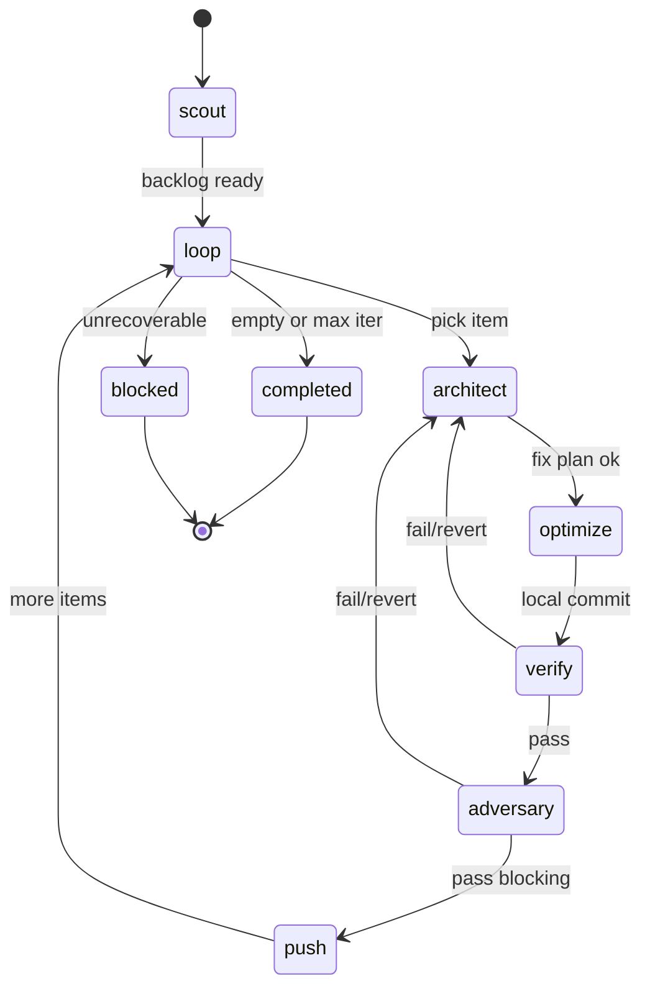

# Perf Orchestrate — Reference

## State machine



## Artifact-paden

| Bestand | Richting | Producer |
|---------|----------|----------|
| `test-reports/perf-optimize-policy.json` | read | team |
| `test-reports/perf-pipeline-state.json` | read/write | orchestrate |
| `test-reports/perf-backlog.json` | read/write | scout |
| `test-reports/perf-baseline.json` | read/write | scout / verify |
| `test-reports/perf-fix-plan-<id>.json` | read | architect |
| `test-reports/perf-verify-<id>.md` | read | verify |
| `test-reports/perf-adversary-<id>.md` | read | adversary |
| `test-reports/perf-pipeline-summary-<datum>.md` | write | orchestrate |

## Backlog item lifecycle

```
open → in_progress → verifying → adversary → done
                  ↘ failed → open (retry) or blocked
```

Update `perf-backlog.json` status per fase.

## Retry matrix

| Verifier uitkomst | Actie |
|-------------------|-------|
| Groen + UX-winst ≥ minUxGainMs | → Adversary |
| Geen UX-winst | revert → Architect volgende tier |
| Regressie elapsedWall | revert → retry (max 2×) → blocked |
| npm test / build rood | revert → blocked |

| Adversary uitkomst | Actie |
|--------------------|-------|
| A1 + A5 pass | → push |
| A1 of A5 fail | revert → retry → blocked |
| A2/A3/A4 fail | waarschuwing in rapport, **geen block** |

## v1 journeys (scope)

| ID | Journey | Meetactie |
|----|---------|-----------|
| J1 | PO board-load | Hard reload `/`, board zichtbaar |
| J2 | RCCP | Navigate `/rccp`, dashboard load |
| J3 | Terugkeer board | `/` → `/rccp` → `/`, count duplicate PO-fetch |

## Branch naming

`perf/<runId>-<backlogItemId>-<short-slug>`

Commit prefix: `perf:` — body vermeldt tier, journey, gemeten winst.
