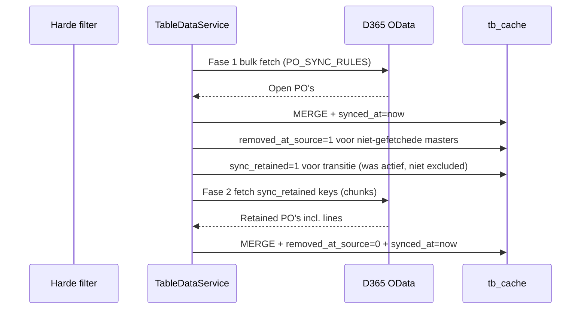

# Implementatieplan — D365 sync-retained orders (optie A)

## Doel

Een PO die in D365 van status verandert (bv. Open → Delivered) en daardoor **niet meer** in de harde D365-syncfilter valt, moet:

1. **Zichtbaar blijven** in de app voor de gebruiker
2. Bij elke refresh **opnieuw uit D365** worden opgehaald
3. Gewijzigde D365-data **doorstromen naar SQL** (`tb_cache` + custom values blijven intact)

Dit zonder een aparte pin-lijst in settings — de cache-rij zelf is de bron van waarheid.

## Probleem vandaag

| Stap | Gedrag |
|------|--------|
| Harde filter | `PO_SYNC_RULES` → OData `$filter` bij refresh |
| Refresh | Alleen matchende PO's worden opgehaald en `synced_at` bijgewerkt |
| Na refresh | Rijen buiten fetch → `removed_at_source = 1` |
| UI | PO blijft in SQL maar wordt getoond als verwijderd in D365 (`removedInD365`) |
| Volgende refresh | PO wordt **niet** meer opgehaald → data veroudert |

## Oplossing (optie A — aanbevolen)

### Kernconcepten

| Concept | Veld / mechanisme | Betekenis |
|---------|-------------------|-----------|
| Harde filter | `PO_SYNC_RULES` | Wat D365 **standaard** oplevert (bv. alleen Open) |
| Bron-scope | `removed_at_source` | Niet in laatste fase-1-fetch |
| Retentie | `sync_retained` (nieuw) | Bewust meenemen ondanks uitval filter |
| Gebruiker verbergt | `tb_row_exclusions` | Niet tonen in board |
| App-zichtbaarheid | `NOT excluded AND (removed_at_source=0 OR sync_retained=1)` | Na fase 2 zijn retained PO's weer `removed_at_source=0` |

### Twee-fase refresh



## Beslissingen uit eerdere discussie

| # | Afspraak | Implementatie |
|---|----------|---------------|
| 1 | Auto-retentie alleen als PO ooit via harde filter in SQL kwam | Retentie bij transitie `removed_at_source: 0→1` na fase 1; geen retentie voor rijen die nooit gesynct waren |
| 2 | Ontpinnen bij wissen door gebruiker **en/of** filterwijziging | `excludeRows` → `sync_retained=0`; `saveSyncFilters` → `UPDATE tb_cache SET sync_retained=0` voor purchase-orders |
| 3 | Limieten met duidelijk gedrag bij cap | Zie sectie Limieten |
| 4 | Geen aparte pin-lijst | `sync_retained` op `tb_cache`; admin toont alleen read-only count |

## Fase 1 — Datamodel (migratie)

**Bestand:** `scripts/db/migrations/018_tb_cache_sync_retained.sql`

```sql
-- Idempotent, dev + prod
ALTER TABLE dbo.tb_cache ADD sync_retained BIT NOT NULL DEFAULT 0;        -- alleen master scope
ALTER TABLE dbo.tb_cache ADD sync_retained_at DATETIME2 NULL;
CREATE INDEX IX_tb_cache_retained ON dbo.tb_cache(table_id, sync_retained)
  WHERE scope = 'master' AND sync_retained = 1;
```

**Regels:**
- `sync_retained` alleen op `scope = 'master'` (detail volgt via parent)
- Bestaande rijen: `sync_retained = 0` (geen retroactieve retentie bij eerste deploy)
- `sync_retained_at` = timestamp wanneer retentie geactiveerd werd (audit + UI)

## Fase 2 — D365 fetch voor retained PO's

**Bestand:** `server/services/D365ODataService.js`

Nieuwe functie `fetchPurchaseOrdersByKeys({ keys, selectFields, lineSelectFields, onProgress })`:

| Aanpak | Voorkeur | Reden |
|--------|----------|-------|
| Chunked `$filter` | **Primair** | `(dataAreaId eq 'X' and PurchaseOrderNumber eq 'Y') or ...` in batches van 20 |
| Entity-key GET + `$expand` | Fallback per PO | Als batch-filter 400 geeft |

**Chunk-strategie:**
- Input: `[{ dataAreaId, orderNumber }]`
- Dedupe op partition+record key
- Max chunk size: **20** (onder `MAX_ONEOF`-cultuur en URL-lengte)
- Hergebruik bestaande `mapPurchaseOrder` / line-mapping
- `$expand=PurchaseOrderLines($select=...)` zoals fase 1

**Tests:** `D365ODataService.test.js` — chunking, escaping, lege input, truncated bij budget.

## Fase 3 — Refresh-flow aanpassen

**Bestand:** `server/services/TableDataService.js` — `refresh()` en `purchaseOrdersFetch()`

### 3a. Fase 1 (ongewijzigd qua filter)

- Bulk fetch met `getTableSyncFilter(table)`
- `persistRecordsChunk` zoals nu
- Na persist: `removed_at_source` update op masters/details

### 3b. Retentie-transitie (nieuw, na fase 1)

SQL (concept):

```sql
-- Masters die net uit scope vielen, niet verborgen door gebruiker
UPDATE c SET sync_retained = 1, sync_retained_at = SYSUTCDATETIME()
FROM dbo.tb_cache c
WHERE c.table_id = @tableId AND c.scope = 'master'
  AND c.removed_at_source = 1
  AND c.synced_at < @refreshStart          -- niet in fase-1-resultaat
  AND c.sync_retained = 0                  -- nog niet retained
  AND NOT EXISTS (tb_row_exclusions ...)
```

**Cap op auto-retentie:** als `COUNT(sync_retained=1)` ≥ `PO_SYNC_RETAINED_MAX_AUTO`:
- Geen nieuwe `sync_retained=1` zetten
- Log + progress warning `retentionCapReached: true`
- PO blijft `removed_at_source=1` (huidig gedrag)

### 3c. Fase 2 (nieuw)

1. Query retained keys:
   ```sql
   SELECT partition_key, record_key FROM tb_cache
   WHERE table_id=@tableId AND scope='master' AND sync_retained=1
     AND NOT EXISTS (exclusions...)
   ORDER BY sync_retained_at
   LIMIT @fetchBudget  -- PO_SYNC_RETAINED_FETCH_BUDGET
   ```
2. `fetchPurchaseOrdersByKeys` in chunks
3. Zelfde `persistRecordsChunk` pad → `removed_at_source=0`, `synced_at=refreshStart`
4. Progress uitbreiden:
   - `retainedFetched`, `retainedTotal`, `retainedPhase: 'fetching'|'saving'|'done'`
   - `retentionCapReached`, `retentionFetchTruncated`

### 3d. Alleen voor `purchase-orders`

Andere tabellen (`vendors`, `items`) erven geen PO-retentie. Generiek patroon kan later via `tb_tables` capability-flag.

## Fase 4 — Levenscyclus events

| Event | Actie |
|-------|-------|
| `saveSyncFilters('purchase-orders', rules)` | `UPDATE tb_cache SET sync_retained=0, sync_retained_at=NULL WHERE table_id=...` |
| `excludeRows` | Per rij ook `sync_retained=0` |
| `includeRows` | **Geen** auto `sync_retained=1`; PO verschijnt alleen als nog in cache en niet removed |
| PO komt weer in harde filter | Fase 1 fetch → `removed_at_source=0`; `sync_retained` mag **blijven** (harmless) of optioneel clearen |
| Custom values / write-back | Ongewijzigd — celdata blijft gekoppeld aan partition+record key |

**Aanbeveling:** `sync_retained` niet automatisch clearen als PO weer in filter valt — voorkomt flip-flop. Alleen clearen bij filterwijziging of user-exclude.

## Fase 5 — Read + UI

### Server `read()`

- Geen filter op `removed_at_source` (al zo) — alle masters worden gelezen
- Voeg toe aan response meta:
  - `retainedCount` — aantal masters met `sync_retained=1`
  - `retentionWarning` — `'none' | 'approaching' | 'critical' | 'cap'`

### Board mapping (`mapTbResponseToBoard`)

- `removedInD365`: `removedAtSource && !syncRetained` (nieuw veld uit read)
- Retained PO's: normale rij-styling, geen doorhaal, write-back blijft werken

### Admin / datamodel

- Cache-stats: `retained_orders`, `retained_cap`, `retained_fetch_budget`
- SyncFilterBuilder: read-only infobox onder filter:
  - *"X orders are retained outside the current sync filter and will be refreshed individually."*
- Drempel-waarschuwingen (geen blokkade):
  - ≥ 200 retained → `approaching`
  - ≥ 500 → `critical`
  - cap bereikt → `cap`

### Refresh-progress UI (optioneel, klein)

- Toon fase 2 in bestaande progress: *"Refreshing 47 retained orders…"*

## Fase 6 — Settings & limieten

**Nieuwe settings** (via `SettingsService`, admin-only):

| Setting | Default | Betekenis |
|---------|---------|-----------|
| `PO_SYNC_RETAINED_MAX_AUTO` | `500` | Max PO's dat auto-retentie mag activeren |
| `PO_SYNC_RETAINED_FETCH_BUDGET` | `500` | Max retained PO's per refresh fase 2 |
| `PO_SYNC_RETAINED_WARN_AT` | `200` | Soft warning in admin |
| `PO_SYNC_RETAINED_CRITICAL_AT` | `500` | Critical warning |

**Gedrag bij limieten:**

| Situatie | Gedrag |
|----------|--------|
| Onder max auto | Nieuwe scope-uitval → `sync_retained=1` |
| Auto-cap bereikt | Geen nieuwe retentie; PO's worden `removedInD365` (fallback) |
| Fetch-budget < retained totaal | Oudste `sync_retained_at` eerst; rest volgende refresh; `retentionFetchTruncated=true` |
| Fase 1 `PO_SYNC_MAX_ORDERS` truncate | Ongewijzigd; fase 2 heeft **eigen budget** |

**Rationale apart budget:** harde filter-cap raakt niet vol door retained uitzonderingen.

## Fase 7 — Tests

| Test | Wat |
|------|-----|
| `TableDataService.refresh` (mock D365) | Transitie 0→1 retained; fase 2 zet removed_at_source=0 |
| `saveSyncFilters` | Cleared alle sync_retained |
| `excludeRows` | Cleared sync_retained voor betreffende PO |
| Cap bereikt | Geen nieuwe retained; warning flag |
| `fetchPurchaseOrdersByKeys` | Chunking, 21 keys → 2 calls |
| `read()` meta | retainedCount correct |
| Board mapping | retained PO niet `removedInD365` |

## Fase 8 — OTAP & versie

1. Migratie `018` op dev (`npm run migrate:db`) en prod bij merge naar `main`
2. `npm test` + `npm run build`
3. Versie-bump in `src/config/version.js`
4. Handmatige validatie op DEV:
   - Filter op Open → refresh
   - Status wijzigen in D365 naar Delivered → refresh
   - PO blijft zichtbaar, data bijgewerkt
   - PO verbergen → verdwijnt, geen fase-2 fetch meer
   - Filter wijzigen → retained count = 0

## Bestanden (verwachte diff)

| Bestand | Wijziging |
|---------|-----------|
| `scripts/db/migrations/018_tb_cache_sync_retained.sql` | Nieuw |
| `server/services/D365ODataService.js` | `fetchPurchaseOrdersByKeys` |
| `server/services/D365ODataService.test.js` | Tests |
| `server/services/TableDataService.js` | Refresh fase 2, retentie-transitie, read meta, exclude/filter lifecycle |
| `server/services/SettingsService.js` | Nieuwe settings keys |
| `src/hooks/usePurchaseOrdersPage.js` | `syncRetained` in mapping |
| `src/components/admin/datamodel/SyncFilterBuilder.jsx` | Retained info (read-only) |
| `src/config/version.js` | Bump |

## Wat we bewust NIET doen

- Geen aparte `PO_SYNC_PINNED_ORDERS` setting
- Geen handmatige pin-UI voor eindgebruikers
- Geen OData mega-OR-filter over honderden PO's
- Geen retroactieve retentie bij eerste deploy
- Geen retained-mechanisme voor vendors/items in deze fase

## Risico's & mitigatie

| Risico | Mitigatie |
|--------|-----------|
| Fase 2 vertraagt refresh | Eigen budget + parallel chunks (max 3 concurrent) |
| D365 batch-filter 400 | Fallback naar entity-key GET per PO |
| Retained groeit onbeperkt | Auto-cap + admin warnings |
| Flip-flop retained ↔ removed | Retained niet clearen bij terugkeer in filter |
| Supplier-scope (niet staff) | Fase 2 alleen keys die al in cache staan voor die supplier-partition |

## Acceptatiecriteria

1. PO die uit harde filter valt na eerdere filter-match blijft zichtbaar en actueel na refresh
2. D365-wijzigingen (status, datums, bedragen) komen in SQL-cache
3. Verborgen PO (`excludeRows`) verdwijnt en wordt niet meer uit D365 gehaald
4. Filterwijziging wist alle retentie; volgende refresh onder nieuwe scope
5. Bij cap: voorspelbaar fallback-gedrag + admin-waarschuwing
6. Geen regressie op fase-1 refresh, exclusions, write-back, custom values
7. Tests groen; migratie idempotent dev+prod

## Alternatieven overwogen (en afgewezen)

| Alternatief | Waarom afgewezen |
|-------------|------------------|
| Pin-lijst in settings | Dubbele bron, OData-limieten, desync-risico |
| Soft filter (breder ophalen) | Te veel D365-data; filterbetekenis vervaagt |
| Alleen cache tonen zonder refresh | Data veroudert — tegen eis |
| `oneof` regel in PO_SYNC_RULES | Max 20 waarden; overschrijft admin-config |

## Vervolg na oplevering

- ADR in `docs/adr/` vastleggen (cache-retentie vs pin-lijst)
- Optioneel DevOps Feature + User Stories via `post-plan-to-devops`
- Later: generiek `sync_retained` capability op `tb_tables` voor andere entiteiten

---

Plan: `.cursor/plans/2026-07-11-d365-sync-retained-orders.plan.md`
