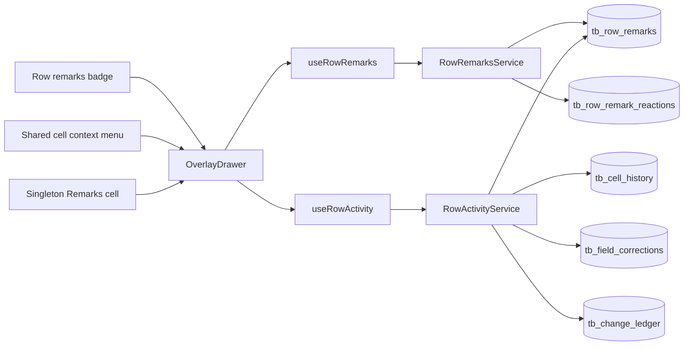

# Row remarks en volledige rijactiviteit op het Purchase Orders board

## Doel

Medewerkers kunnen per purchase-orderrij opmerkingen uitwisselen en in hetzelfde zijpaneel alle relevante rijwijzigingen terugzien, zodat overleg en auditinformatie niet meer buiten het board hoeven te worden bijgehouden.

## User story

**Als** medewerker die purchase orders beoordeelt  
**wil ik** opmerkingen, reacties en volledige wijzigingsgeschiedenis per orderrij kunnen bekijken en toevoegen  
**zodat** de context, opvolging en audittrail centraal en direct bij de juiste order beschikbaar zijn.

## Vastgelegde scope en aannames

- Alleen masterrijen/PO-headers vallen in scope: `detail_key = -1`.
- Bestaande orderregels/subitems krijgen in deze versie geen eigen remarks.
- Alleen rollen die het huidige `/api/data`-board mogen gebruiken (`admin` en `employee`) krijgen toegang.
- De Remarks-kolom is een singleton per tabel en masterscope: maximaal één exemplaar.
- De kolom heeft altijd sleutel en label `remarks` / `Remarks`, is read-only en kan niet worden hernoemd.
- De kolom mag worden gedeactiveerd en via “Add column right” opnieuw geactiveerd en rechts van de gekozen kolom geplaatst worden.
- Filteren, sorteren, groeperen, formules, write-back, bulk edit en “Copy cell value” zijn niet beschikbaar voor het Remarks-kolomtype.
- Gebruikers kunnen niet op hun eigen remark reageren; andere gebruikers kunnen één of meer toegestane emoji-reacties plaatsen.
- Remarks zijn immutable. Verwijderen is een soft delete: de normale UI toont een tombstone zonder inhoud; de database bewaart de oorspronkelijke tekst voor audit.
- Alle gebruikerszichtbare nieuwe UI-teksten zijn Engels conform de actieve workspace-regel.
- `created_at`, auteur en deletegegevens worden uitsluitend server-side vastgesteld.
- Geen realtime-infrastructuur wordt toegevoegd. Alleen het geopende panel gebruikt lichte delta-polling.

## Definitie van klaar

1. Iedere zichtbare PO-headerrij toont naast de selectiecheckbox een remarkballon; zonder remarks is deze leeg en bij remarks toont deze het actuele aantal niet-verwijderde remarks.
2. Klik op de ballon, de Remarks-cel of “Remarks” in het celcontextmenu opent hetzelfde panel voor de juiste `dataAreaId + orderNumber`.
3. Het panel gebruikt een Fluent UI `OverlayDrawer`, sluit met Escape en de sluitknop, houdt focus binnen het panel en herstelt focus naar de opener.
4. Het panel bevat de tabs “Remarks”, “History” en “All”, met tellers en afzonderlijke loading-, empty-, error- en retry-states.
5. Remarks en gecombineerde activiteit staan nieuwste-eerst, hebben stabiele cursorpaginering en kunnen zonder duplicaten of overgeslagen records verder worden geladen terwijl nieuwe activiteit binnenkomt.
6. History bevat D365-refreshwijzigingen, custom-celledits, D365-write-backpogingen/status en rijacties zoals verbergen/herstellen, zonder dubbele USER-ledgeritems.
7. De composer toont de huidige gebruiker en optionele kolomcontext; de opgeslagen remark toont de server-timestamp en server-auteur.
8. Een remark accepteert 1–2000 tekens na normalisatie/trim en wordt uitsluitend als platte React-tekst weergegeven.
9. Reacties gebruiken de whitelist `👍`, `😊`, `🎉`, `❤️`, `😂`, `😮`, zijn keyboardbedienbaar en worden atomair/idempotent opgeslagen.
10. Een employee kan alleen een eigen remark verwijderen; een admin kan iedere remark verwijderen; cross-table en cross-row ID’s worden geweigerd.
11. De standaard Remarks-kolom bestaat na migratie precies één keer en toont per rij de laatste niet-verwijderde remark met auteur en tijd.
12. Een directe `PUT /api/data/:tableKey/value` naar een Remarks-kolom retourneert HTTP 400 en schrijft niets naar `tb_custom_values`.
13. Het geopende panel pollt alleen delta’s, pauzeert wanneer de browserpagina verborgen is, voorkomt overlappende requests, gebruikt backoff bij fouten en ruimt timers/requests op bij sluiten.
14. Geen gewijzigd componentbestand overschrijdt 300 regels, geen component krijgt meer dan 10 props en netwerklogica blijft in feature-hooks/services.
15. Migratie 023 is idempotent en non-destructief, draait via preview op DEV en via de productie-deploy op PROD.
16. `npm test` en `npm run build` slagen en de volledige gebruikersflow is tegen de preview-URL in de browser gevalideerd.
17. `src/config/version.js` en `src/config/devTestItems.js` zijn bijgewerkt.

## Wat al bestaat en wordt hergebruikt

| Bestaande basis | Locatie | Gebruik |
|---|---|---|
| Per-cel historie-API | `TableDataService.getCellHistory()` en `GET /api/data/:tableKey/history` | Waardeformattering en validatiepatronen |
| Custom-cel audit | `dbo.tb_cell_history` | Custom-celledits |
| D365 write-back audit | `dbo.tb_field_corrections` | Write-backstatus en oude/nieuwe waarde |
| Centrale change-ledger | `dbo.tb_change_ledger` | D365-refreshwijzigingen en rijacties |
| History-UI | `src/components/supplier/CellHistoryPopover.jsx` | Presentatiepatronen; formatters worden gedeeld |
| Boardrij en celmenu | `PurchaseOrdersBoardRows.jsx`, `PurchaseOrderDataCell.jsx` | Integratiepunten |
| API-client en timing | `src/utils/api.js`, `server/utils/timing.js` | Verplichte request- en timinginstrumentatie |
| QAQC-chatreferentie | `reyniervanbommel-commits/QAQC-app` | Alleen visuele inspiratie; geen runtime-afhankelijkheid |

De bestaande lokale wijziging in `CellHistoryPopover.test.jsx` is geen onderdeel van deze feature en wordt niet ongemerkt meegenomen.

## Architectuur

### Services

- `RowRemarksService` is eigenaar van remarks, soft delete, reacties en row-summary.
- `RowActivityService` is eigenaar van de read-only History- en All-feed.
- `TableDataService` blijft eigenaar van tabeldata en celwrites; alleen `assertCustomColumnWritable()` wordt uitgebreid om `remarks` te blokkeren.
- `TableColumnsService` blijft eigenaar van de singleton Remarks-kolom.
- De nieuwe services gebruiken `TableRegistryService` om `tableKey` naar `table_id` te valideren.

### Activiteitsbronnen en deduplicatie

`RowActivityService` combineert:

1. `tb_change_ledger` met `source = 'D365'`: alle D365-refreshmutaties.
2. `tb_change_ledger` met `source = 'USER' AND field_key IS NULL`: rijacties zoals hide/restore.
3. `tb_cell_history`: custom-celledits.
4. `tb_field_corrections`: write-backpogingen en status.
5. `tb_row_remarks`: alleen bij `kind=all`.

USER-ledgerregels met een `field_key` worden niet in de feed opgenomen, omdat dezelfde custom edit of write-back al rijker in `tb_cell_history` respectievelijk `tb_field_corrections` staat. Hiermee worden dubbele items voorkomen.

### Cursor en sortering

- Feedvolgorde: `created_at DESC`, daarna een vaste type-rang en bron-ID `DESC`.
- De server geeft een opaque base64url-cursor terug met timestamp, type-rang en ID.
- Cursorinput wordt server-side gevalideerd; ongeldige cursors geven HTTP 400.
- Default `limit = 50`, minimum 1, maximum 100.
- `nextCursor = null` betekent dat alle oudere items geladen zijn.
- Delta-polling gebruikt een afzonderlijke `afterCursor` van het nieuwste bekende item en verandert de oudere-pagecursor niet.

## Datamodel en migratie

Maak `scripts/db/migrations/023_tb_row_remarks.sql`. De migratie is volledig idempotent en non-destructief.

### `dbo.tb_row_remarks`

- `id BIGINT IDENTITY PRIMARY KEY`
- `table_id BIGINT NOT NULL`, FK naar `tb_tables(id)`, geen cascade
- `partition_key NVARCHAR(32) NOT NULL`
- `record_key NVARCHAR(128) NOT NULL`
- `detail_key INT NOT NULL DEFAULT -1`, CHECK `detail_key = -1`
- `column_id BIGINT NULL`, FK naar `tb_columns(id)`, `ON DELETE SET NULL`
- `body NVARCHAR(2000) NOT NULL`
- `created_by INT NULL`, FK naar `users(id)`, `ON DELETE SET NULL`
- `created_at DATETIME2 NOT NULL DEFAULT SYSUTCDATETIME()`
- `is_deleted BIT NOT NULL DEFAULT 0`
- `deleted_by INT NULL`, FK naar `users(id)`, `ON DELETE SET NULL`
- `deleted_at DATETIME2 NULL`
- CHECK: bij een actieve remark zijn `deleted_by` en `deleted_at` beide NULL; bij soft delete is `deleted_at` verplicht en mag `deleted_by` later NULL worden als de gebruiker wordt verwijderd

De service valideert daarnaast dat `column_id`, indien aanwezig, bij dezelfde `table_id`, masterscope en een actieve kolom hoort. Dit kan niet veilig met alleen een enkelvoudige FK worden afgedwongen.

### `dbo.tb_row_remark_reactions`

- `id BIGINT IDENTITY PRIMARY KEY`
- `remark_id BIGINT NOT NULL`, FK naar `tb_row_remarks(id)`, `ON DELETE CASCADE`
- `user_id INT NOT NULL`, FK naar `users(id)`, `ON DELETE CASCADE`
- `emoji NVARCHAR(16) NOT NULL`
- `created_at DATETIME2 NOT NULL DEFAULT SYSUTCDATETIME()`
- UNIQUE `(remark_id, user_id, emoji)`
- CHECK op de zes toegestane emoji’s

### Indexen

- Remarks: `(table_id, partition_key, record_key, detail_key, is_deleted, created_at DESC, id DESC)`.
- Reactions: unieke index hierboven plus index op `(remark_id)`.
- Row history custom: `tb_cell_history(table_id, partition_key, record_key, detail_key, changed_at DESC, id DESC)` met `column_id` included.
- Row history write-back: `tb_field_corrections(table_id, partition_key, record_key, detail_key, created_at DESC, id DESC)` met `column_id`, `status` included.
- `tb_change_ledger` gebruikt de bestaande `IX_tb_change_ledger_record`.

### Singleton Remarks-kolom

- Recreate `CK_tb_columns_data_type` met `remarks` toegevoegd.
- Voeg een gefilterde unieke index toe op `(table_id, scope, data_type)` waar `data_type = 'remarks'`.
- Seed idempotent één actieve masterkolom voor `purchase-orders`:
  - key `remarks`
  - label `Remarks`
  - source `custom`
  - data_type `remarks`
  - `writable = 0`
  - `filterable = 0`
  - `sortable = 0`
  - `is_default_visible = 1`
- Een bestaande inactieve Remarks-kolom wordt geactiveerd; er wordt nooit een tweede gemaakt.

## API-contract

Alle routes staan onder het bestaande `/api/data`-mountpunt en erven `requireSession` plus `admin/employee`. Iedere mutatie bindt `tableKey`, `table_id`, rij-identiteit en remark-ID in dezelfde servicequery.

### Gedeelde foutstatussen

- `400`: ongeldige sleutel, body, cursor, limit, columnId, emoji of datatypeactie.
- `403`: onvoldoende ownership/rol of reageren op eigen remark.
- `404`: onbekende tabel, masterrij, kolom of remark binnen de opgegeven tabel.
- `409`: mutatie op een verwijderde remark of een conflicterende toestand.

### Remark-shape

Een remark bevat:

- `id`
- `partitionKey`, `recordKey`
- `column`: `{ id, key, label }` of `null`
- `body`: tekst of `null` bij tombstone
- `isDeleted`
- `author`: `{ id, displayName }` of `null`
- `createdAt`, `deletedAt`
- `reactions`: lijst `{ emoji, count, reactedByCurrentUser }`
- `canDelete`

### Routes

- `GET /api/data/:tableKey/remarks?partitionKey=&recordKey=&cursor=&limit=`
  - HTTP 200: `{ items, total, nextCursor }`
  - Nieuwste remarks eerst; tombstones blijven zichtbaar maar zonder body.
- `POST /api/data/:tableKey/remarks`
  - Body: `{ partitionKey, recordKey, body, columnId? }`
  - HTTP 201: `{ remark }`
- `DELETE /api/data/:tableKey/remarks/:id`
  - Body: `{ partitionKey, recordKey }`
  - HTTP 200: `{ remark: tombstone }`
- `PUT /api/data/:tableKey/remarks/:id/reaction`
  - Body: `{ partitionKey, recordKey, emoji, active }`
  - HTTP 200: `{ reactions }`
  - `active=true` is insert-if-missing; `active=false` is delete-if-present.
- `GET /api/data/:tableKey/remarks/summary`
  - HTTP 200: `{ rows: [{ partitionKey, recordKey, count, latest }] }`
  - `latest` bevat alleen `id`, een server-begrensde `bodyPreview` van maximaal 280 tekens, `authorName` en `createdAt`.
- `GET /api/data/:tableKey/activity?partitionKey=&recordKey=&kind=history|all&columnId?=&cursor=&afterCursor=&limit=`
  - HTTP 200: `{ items, totals: { remarks, history }, nextCursor, newestCursor }`
  - `kind=history` sluit remarks uit; `kind=all` geeft één server-side chronologische feed.

### Validatie en beveiliging

- `partitionKey` en `recordKey` volgen de bestaande maxima van 32 en 128 tekens.
- Add/delete/reaction valideert dat de masterrij in `tb_cache` bij de tabel bestaat.
- `columnId` moet actief, master en van dezelfde tabel zijn.
- `remarkId` wordt altijd samen met `table_id`, `partition_key` en `record_key` gezocht.
- Actor, auteur, rol en timestamps komen uitsluitend uit `req.user` en SQL-server-tijd.
- Body wordt naar NFC genormaliseerd en getrimd; lege of alleen-control-character input wordt geweigerd. Newline en tab blijven toegestaan.
- SQL is volledig geparametriseerd.
- UI rendert body en labels als platte React-tekst; geen markdown, HTML, `innerHTML` of `dangerouslySetInnerHTML`.
- Reaction-write gebruikt een transactie met geschikte locks; herhaalde identieke requests zijn no-ops en veroorzaken geen duplicate-key-fout.
- `TableDataService.assertCustomColumnWritable()` weigert `dataType === 'remarks'` expliciet met HTTP 400.

## Frontend-UX

### Drawer

Gebruik Fluent UI v9 `OverlayDrawer` uit de bestaande Fluent dependency:

- `position="end"` en modal gedrag.
- Desktopbreedte 480 px; maximaal 520 px.
- Volledige viewportbreedte onder 600 px.
- Header met PO-nummer, optionele kolomcontext en sluitknop.
- Escape sluit; focus start op de drawerheading en kan daarna naar de composer.
- Bij sluiten keert focus terug naar het ballonnetje, de cel of het contextmenu-element dat opende.
- De draft blijft behouden bij een mislukte POST en verdwijnt alleen na succesvolle opslag.

### Tabs

- `Remarks`: composer bovenaan en remarkkaarten daaronder.
- `History`: read-only tijdlijn van alle niet-remarkactiviteiten.
- `All`: composer bovenaan en één server-side chronologische feed van remarks plus history.
- Tabs tonen “Remarks (n)” en “History (n)”.
- Fluent `TabList` verzorgt pijltjestoetsen en tabsemantiek.
- History en All hebben een “All columns”-filter; openen vanuit een cel selecteert die kolom vooraf.
- Elke tab heeft een eigen skeleton/loading-state, empty-state, inline error en Retry-knop.

### Feedpresentatie

- Remarks zijn rustige kaarten met avatar, auteur, server-tijd, kolomtag, tekst en een vaste reaction-toolbar.
- History-items zijn compacte tijdlijnregels met tekst én icoon voor bron/type, kolomnaam, oude en nieuwe waarde, auteur, status en tijd.
- Dagscheidingen gebruiken “Today”, “Yesterday” of een volledige datum en mogen sticky zijn binnen de drawer.
- Lange waarden gebruiken CSS-ellipsis en een native `title`; geen Fluent `Tooltip`, `Menu`, `Popover` of `Dialog` in herhaalde feeditems.
- Delete gebruikt een inline tweestapsbevestiging in de eigen kaart; geen Dialog per kaart.
- Reaction-knoppen zijn vaste inline knoppen met `aria-pressed`, toegankelijke labels en zichtbare aantallen.
- Eigen remark toont reaction-knoppen disabled met een toegankelijk label.
- “Show older remarks” en “Show older activity” laden de volgende cursorpagina.

### Polling

- Alleen actief zolang de drawer open en `document.visibilityState === 'visible'` is.
- Interval start op 5 seconden.
- Poll haalt uitsluitend delta’s via `afterCursor`.
- Maximaal één request per hook tegelijk; nieuwe tick wordt overgeslagen zolang een request loopt.
- Iedere request krijgt een `AbortController`; cleanup bij rijwissel, tabwissel en sluiten.
- Bij fouten exponentiële backoff tot maximaal 60 seconden; handmatige Retry reset de backoff.
- Een succesvolle delta-update ververst ook teller en laatste remark voor alleen de geopende rij.

## Bestanden en concrete wijzigingen

### Story 1 — Board-hotspots veilig splitsen

Nieuwe bestanden:

- `src/components/supplier/PurchaseOrderBoardRow.jsx`
- `src/components/supplier/PurchaseOrdersPageContent.jsx`
- `src/components/supplier/PurchaseOrderCellContextMenu.jsx`
- `src/hooks/usePurchaseOrdersBoardLinks.js`

Wijzig:

- `PurchaseOrdersBoardRows.jsx`: individuele rijrendering naar `PurchaseOrderBoardRow`; bestand onder 250 regels.
- `PurchaseOrdersPage.jsx`: loading/empty/table-content naar `PurchaseOrdersPageContent`; bestand onder 250 regels.
- `PurchaseOrdersBoardTable.jsx`: linked-columnberekeningen naar `usePurchaseOrdersBoardLinks`; bestand onder 250 regels.
- `PurchaseOrderDataCell.jsx`: vervang de per-cel Fluent `Menu` door een native `onContextMenu`-melding aan één gedeeld `PurchaseOrderCellContextMenu`.
- Groepeer props in stabiele objectcontracten (`layout`, `formatting`, `cellActions`, `remarks`) zodat ieder component maximaal 10 props heeft.
- Behoud bestaand filter/clear/copy-gedrag in het gedeelde contextmenu.

Acceptatiecriteria Story 1:

1. Bestaand filteren, clear filter en copy via rechtsklik werken ongewijzigd.
2. Er bestaat maximaal één Fluent contextmenu-instance voor de tabel.
3. Genoemde componentbestanden blijven onder 300 regels en componenten hebben maximaal 10 props.
4. Bestaande purchase-ordertests blijven groen.

### Story 2 — Remarks-datamodel, kolom en API

Nieuwe bestanden:

- `scripts/db/migrations/023_tb_row_remarks.sql`
- `server/services/RowRemarksService.js`
- `server/services/RowRemarksService.test.js`

Wijzig:

- `server/services/TableRegistryService.js`: voeg `remarks` toe aan `DATA_TYPES`.
- `server/services/TableColumnsService.js`: singleton ensure/reactivate, masterscope-only, fixed label/key en geen formule/imagepad.
- `server/services/TableColumnsService.test.js`: datatype- en singletontests.
- `server/services/TableDataService.js`: `assertCustomColumnWritable()` blokkeert remarks.
- `server/routes/data.js`: remarksroutes en expliciete query/bodyvalidatie.

Acceptatiecriteria Story 2:

1. Migratie kan herhaald draaien zonder duplicaten of destructieve wijzigingen.
2. Er bestaat maximaal één Remarks-kolom per tabel/masterscope.
3. Add, list, summary, soft delete en reactions volgen exact het API-contract.
4. Ownership, admin-delete, cross-table IDOR en rij-/kolomvalidatie zijn getest.
5. Reaction-write is atomair en idempotent getest.
6. Directe custom-valuewrites naar Remarks worden met HTTP 400 geweigerd.

### Story 3 — Volledige rijgeschiedenis en gecombineerde feed

Nieuwe bestanden:

- `server/services/RowActivityService.js`
- `server/services/RowActivityService.test.js`

Wijzig:

- `server/routes/data.js`: activityroute.
- Migratie 023: row-history-indexen.
- `src/utils/cellHistoryFormat.js`: gedeelde pure datum-, status- en waardeformatters.
- `CellHistoryPopover.jsx`: gebruikt de gedeelde formatters zonder functionele regressie.

Acceptatiecriteria Story 3:

1. History toont D365, custom, write-back en rijacties uit de vastgelegde bronnen.
2. USER field-ledgeritems worden niet dubbel naast cell history/write-back getoond.
3. History en All gebruiken stabiele cursorpaginering zonder overlap of gaten.
4. Columnfilter valideert dezelfde-table masterkolommen.
5. Querytests bewijzen correcte sortering, bronmapping, counts en cursors.
6. Zware queries zijn gewrapt in `time('remarks_activity', ...)`.

### Story 4 — Toegankelijk remarks- en activiteitspanel

Nieuwe featuremap `src/components/supplier/remarks/` met `index.js`:

- `RemarksPanel.jsx`
- `RemarkComposer.jsx`
- `RemarkMessageCard.jsx`
- `RemarkReactionBar.jsx`
- `RowActivityFeed.jsx`
- `RowHistoryEntry.jsx`
- `RowRemarksBadge.jsx`
- `RemarksLatestCell.jsx`
- `usePurchaseOrderRemarksController.js`
- `useRowRemarks.js`
- `useRowActivity.js`
- `useRemarksSummary.js`

Hooks bevatten geen JSX, maximaal drie effecten, maximaal tien returnwaarden, stabiele callbacks/objects, en leveren `loading` en `error`.

Acceptatiecriteria Story 4:

1. Drawer, tabs, focus, Escape en focusherstel zijn keyboardtoegankelijk.
2. Loading-, empty-, error-, retry- en mislukte-submitstates zijn zichtbaar en bruikbaar.
3. Remarks, history en All volgen de afgesproken visuele hiërarchie en dagscheidingen.
4. Reaction-toolbar gebruikt geen portalcomponent en ondersteunt `aria-pressed`.
5. Polling gebruikt delta’s, cleanup, visibility pause, overlapbeveiliging en backoff.
6. Geen nieuwe featurecomponent overschrijdt 250 regels.

### Story 5 — Boardintegratie, Remarks-kolom en validatie

Wijzig:

- `purchaseOrderColumnFilterMenuConstants.js`: voeg Remarks-type en metadata toe.
- `PurchaseOrderAddColumnPane.jsx`: toon Remarks; disabled met “Already added” als de actieve singleton al bestaat.
- `PurchaseOrderColumnFilterMenuMainPane.jsx` en relevante panels: verberg niet-ondersteunde filter/sort/group/rename/write-backacties voor Remarks.
- `PurchaseOrderBoardRow.jsx`: ballon naast checkbox en `RemarksLatestCell` voor de singletonkolom.
- `PurchaseOrderCellContextMenu.jsx`: menu-item “Remarks” met kolomcontext.
- `PurchaseOrdersPage.jsx` / `PurchaseOrdersPageContent.jsx`: remarkscontroller en drawer koppelen zonder `usePurchaseOrdersPage.js` uit te breiden.
- `src/config/version.js`: PATCH-versie verhogen.
- `src/config/devTestItems.js`: één concreet feature-item met de browserchecks.

Acceptatiecriteria Story 5:

1. Ballon, contextmenu en Remarks-cel openen dezelfde correcte rij.
2. Teller en laatste remark worden na lokale en gepollde mutaties bijgewerkt.
3. Remove/reactivate van de singletonkolom werkt zonder duplicaat.
4. Niet-ondersteunde kolomacties zijn niet beschikbaar.
5. De preview-browserflow werkt met twee verschillende gebruikers.

## Testplan

### Backend

- Bodygrenzen: leeg, whitespace/control-only, 1, 2000 en 2001 tekens.
- Sleutel- en cursorvalidatie.
- Row existence en same-table/same-column validatie.
- Employee own delete, employee foreign delete, admin delete.
- Cross-table en cross-row remark/reaction-ID’s.
- Soft-delete tombstone, summary count en fallback naar vorige laatste remark.
- Reactie active true/false, dubbele retries, gelijktijdige requests, eigen remark en deleted remark.
- Read-only Remarks-kolom via `/value`.
- Singleton seed, add, deactivate en reactivate.
- Historybronmapping, deduplicatie, columnfilter en stabiele cursors.
- XSS-payload blijft platte tekst in het responsecontract.

### Frontend

- Badge zonder count en met actuele count.
- Drawer openen vanuit badge, cel en contextmenu.
- Focusstart, Escape en focusherstel.
- Tabs, tellers, dagscheidingen en columnfilter.
- Loading, empty, error, retry en submit-draftbehoud.
- Reaction `aria-pressed`, disabled eigen remark en mutation rollback/fout.
- Cursor “Show older” zonder duplicaten.
- Poll cleanup, hidden-page pause, overlapbeveiliging en backoff.
- RemarksLatestCell met native title en zonder Tooltip/Popover.

### Preview-browsertest

1. Open een PO zonder remarks; controleer leeg ballonnetje en lege staten.
2. Open Remarks via een normale cel; controleer vooraf ingevulde kolomcontext.
3. Plaats een remark; controleer serverauteur/tijd, teller en Remarks-kolom.
4. Log in als tweede employee en plaats/verwijder reacties.
5. Controleer dat de eerste employee geen foreign remark kan verwijderen.
6. Wijzig een custom cel, voer een D365 write-back uit en refresh D365; controleer de History- en All-feed.
7. Laad oudere activiteit en controleer chronologische volgorde zonder duplicaten.
8. Test volledig met toetsenbord, Escape en focusherstel.
9. Controleer mobiel/smal viewportgedrag.
10. Controleer browserconsole en netwerk op fouten en inspecteer `Server-Timing`.

Sla het rapport op volgens de projectregel in `test-reports/test-report-feature-<id>-row-remarks-2026-07-13.md`.

## Uitvoeringsvolgorde en afhankelijkheden

1. Story 1 maakt de boardintegratie veilig en moet eerst.
2. Story 2 levert schema, singletonkolom en remarks-API.
3. Story 3 bouwt op migratie 023 en levert volledige activiteit.
4. Story 4 kan na vastlegging van de API-contracten parallel voorbereid worden, maar wordt tegen Story 2 en 3 geïntegreerd.
5. Story 5 koppelt alles aan het board en rondt versie/testmenu af.
6. Daarna: `npm test`, `npm run build`, previewdeploy, DEV-migratie, browsertest en team-review.
7. Bij merge naar `main`: dezelfde migratie via de productie-deploy uitvoeren en PROD-schema verifiëren.

## Performance en observability

- Alle frontendcalls gebruiken `apiRequest`; geen raw `fetch`.
- Remarks-, summary- en activityquery’s gebruiken `time()` met vaste labels.
- Summary retourneert alleen een preview, niet de volledige body per boardrij.
- Cursorpagina’s zijn maximaal 100 items.
- Feedmerge en daggroepering worden met `useMemo` uitgevoerd; bij aantoonbaar zware clientberekening wordt `measure()` gebruikt.
- Geen polling buiten het geopende panel.

## Buiten scope

- Remarks op subitems/orderregels.
- Mentions, e-mail- of pushnotificaties.
- Ongelezenstatus per gebruiker.
- Rich text, bestanden en afbeeldingen in remarks.
- Bewerken van bestaande remarks.
- WebSockets of Server-Sent Events.

## DevOps-structuur

Maak één Feature met vijf child User Stories overeenkomstig Story 1–5. Iedere story gebruikt de eigen acceptatiecriteria uit dit plan. Tags: `remarks; purchase-orders; activity-feed; fluent-ui; sql; audit`.

