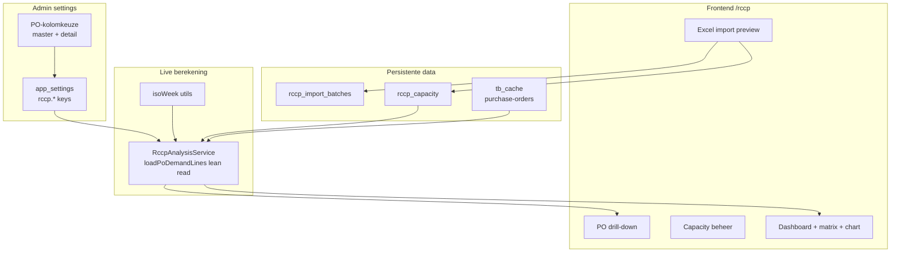

# RCCP — Rough Cut Capacity Planning

## User story

Als planner (admin/employee) wil ik per leverancier en ISO-week de beschikbare productiecapaciteit vergelijken met PO-belasting op basis van configureerbare PO-kolommen, zodat we over- en under-capacity vroeg zien en kunnen bijsturen.

**Business value:** voorkom productie-overbelasting bij leveranciers en benut vrije capaciteit door vroegtijdige inzichten uit bestaande PO-data — zonder dubbele masterdata.

## Acceptatiecriteria

- [ ] RCCP-pagina bereikbaar via `/rccp` in navigatie voor alle ingelogde rollen
- [ ] Admin kan op Admin → RCCP de kolommen voor leverdatum, aantal en categorie kiezen uit purchase-orders kolommen (type-gefilterde dropdowns)
- [ ] Admin/employee kan capaciteit handmatig toevoegen, bewerken en verwijderen (met bevestiging)
- [ ] Excel-template downloaden, uploaden, preview met geldige/foute regels, commit met samenvatting (added/updated/skipped/rejected)
- [ ] Dashboard toont summary cards, matrix (categorie × week/maand) en grafiek met kleur **én** tekststatus (OK / Near limit / Over capacity / No data)
- [ ] Drill-down vanuit week-matrixcel toont onderliggende PO-regels; maandweergave drill-down filtert op alle ISO-weken in die maand
- [ ] PO-regels zonder datum of categorie verschijnen in aparte waarschuwing, niet stil weggevallen
- [ ] Capaciteit zonder PO-demand (categorie nog niet in PO's) toont waarschuwing, geen import-fout
- [ ] Supplier ziet alleen eigen vendor, read-only (geen import/CRUD)
- [ ] Wijziging leverdatum op PO-board reflecteert in RCCP na refresh (live berekening, geen demand-cache)
- [ ] Migratie `026_rccp_capacity.sql` idempotent; `npm test` groen incl. isoWeek + analysis + import tests
- [ ] Browser-test op preview: import 1 regel → zichtbaar in matrix; overschrijding rood + label "Over capacity"
- [ ] `devTestItem` toegevoegd in `src/config/devTestItems.js`; versie bump in `src/config/version.js`

## DevOps-structuur

**Feature:** RCCP — Rough Cut Capacity Planning

**Child User Stories:**

| # | Story | Eigen "klaar"-definitie |
|---|-------|-------------------------|
| 1 | Foundation (DB, settings, auth) | Migratie + settings API + admin tab + middleware gemount |
| 2 | Capacity CRUD + Excel import | Handmatig beheer + import preview/commit end-to-end |
| 3 | Analysis + dashboard | Matrix/cards/chart met live PO-belasting |
| 4 | Drill-down + tests + docs | PO drill-down, devTestItems, guides, tests groen |

**Tags:** `rccp;capacity-planning;purchase-orders;excel-import;admin-settings`

---

## Bevindingen uit de codebase

### Wat al bestaat en hergebruikt wordt

| Onderdeel | Bestaande bron | RCCP-gebruik |
|-----------|----------------|--------------|
| Vendor-identificatie | `VendorAccountNumber` → app-key `vendorAccount` | FK op capaciteitsregels + supplier-scoping |
| PO-data | `tb_cache` via [`TableDataService.js`](server/services/TableDataService.js) | Lean demand-read (niet volledige `read()`) |
| Vendor-master | `tb_tables.key = 'vendors'` | Valideren vendorcodes bij import |
| Item-verrijking | fk_join `ItemNumber` → `items` | Categoriewaarden via configureerbare PO-kolom |
| Kolomregistry | `tb_columns` voor `purchase-orders` (master + detail) | Admin kiest datum/aantal/categorie-kolom |
| Auth | [`supplierScope.js`](server/utils/supplierScope.js) | Staff: alles; supplier: read-only eigen vendor |
| Excel-parsing | [`ExcelLinkService.js`](server/services/ExcelLinkService.js) + multer in [`dataLinks.js`](server/routes/dataLinks.js) | Import-wizard + upload (15MB, memoryStorage) |
| Charts | `recharts` in [`UserAnalytics.jsx`](src/components/admin/UserAnalytics.jsx) | Periode-grafiek |
| Instellingen | [`SettingsService.js`](server/services/SettingsService.js) + `dbo.app_settings` | RCCP-configuratie |
| Audit | [`auditLog.js`](server/middleware/auditLog.js) | Import + settings-wijzigingen |

### Belangrijke gaps (opgelost via admin-configuratie)

- **Geen `confirmedDeliveryDate` out-of-the-box** — alleen `requestedDeliveryDate`. Admin kiest op RCCP-instellingenpagina welke PO-kolom leidend is (kan later een custom kolom of D365-kolom zijn zodra die in `tb_columns` staat).
- **Geen regel-status** — alleen header `status` (`PurchaseOrderStatus`, incl. `Canceled`). Uitsluiting via configureerbare statusfilter in settings.
- **Alleen `quantity` (OrderedPurchaseQuantity)** — admin kiest welk numeriek PO-kolomveld telt als demand-aantal (dropdown: **detail scope only**).
- **Itemkenmerken beperkt in seed** — categorie komt uit een **configureerbare PO-kolom** (inclusief fk_join-verrijkte velden zoals `itemGroupId`).

---

## Architectuuroverzicht



**Kernprincipe:** alleen **capaciteit** opslaan; PO-belasting altijd **live** uit `tb_cache` berekenen zodat leverdatumwijzigingen automatisch meekomen.

---

## Functionele keuzes (bevestigd)

| Keuze | Beslissing |
|-------|------------|
| Toegang | Admin + employee: beheren + alle vendors; supplier: read-only eigen vendor |
| Periode | **ISO-week primair** (`period_year` + `iso_week`); maandweergave afgeleid |
| Datum/aantal/categorie | Admin configureerbaar via instellingen, gekozen uit PO-kolommen |
| Settings schrijven | **Admin-only** PUT; employee GET read-only |
| Vendor-ID | `vendorAccount` (VendorAccountNumber) |

---

## Datamodel (migratie `026_rccp_capacity.sql`)

Idempotent (`IF NOT EXISTS`). Zelfde commit/PR als code die tabellen gebruikt.

### `rccp_capacity`

- `id`, `vendor_account`, `period_year`, `iso_week` (1–53)
- `capacity_category` (NVARCHAR, vrije string; waarschuwing als nog niet in PO-data)
- `capacity_quantity` (DECIMAL, paren)
- `created_at/by`, `updated_at/by`, `import_batch_id` (nullable)
- **UNIQUE** `(vendor_account, period_year, iso_week, capacity_category)`

Geen aparte `period_month` kolom — maand wordt afgeleid via ISO-week.

### `rccp_import_batches`

- `id`, `original_filename`, `imported_at`, `imported_by`, `summary_json`
- Audit-koppeling naar capaciteitsregels via `import_batch_id`

### `app_settings` keys (JSON-waarden)

| Key | Inhoud | Default seed (migratie) |
|-----|--------|-------------------------|
| `rccp.deliveryDateColumnKey` | detail kolom, type date; fallback master | `requestedDeliveryDate` |
| `rccp.quantityColumnKey` | **detail only**, type number | `quantity` |
| `rccp.categoryColumnKey` | detail of master, type text/status | `itemGroupId` |
| `rccp.excludedStatuses` | JSON-array | `["Canceled"]` |
| `rccp.utilizationWarningPct` | number | `85` |
| `rccp.utilizationCriticalPct` | number | `100` |
| `rccp.importDuplicatePolicy` | `update` \| `skip` \| `ask` | `update` |

### Settings UI kolomfilters

- **Delivery date:** `data_type = date`, scope detail (master als fallback-bron benoemd in hint)
- **Quantity:** `data_type = number`, scope **detail only** (voorkomt dubbeltelling)
- **Category:** `data_type IN ('text','status')`, scope detail of master

---

## PO-demand laden (definitief)

`RccpAnalysisService.loadPoDemandLines()` roept een **lean helper** aan — **niet** volledige `TableDataService.read()` (geen ledger, history hints, formula-diff, activity badges).

**Herbruik uit TableDataService (extract of delegatie):**

- `readCacheRows(pool, tableId, includeRemoved)`
- `loadLookupEnrichment(table)` + fk_join lookup toepassing
- Kolomwaarde-resolutie op basis van RCCP settings keys

**Timing:** `time('rccp_demand')`, `time('rccp_aggregate')`

---

## Berekeningslogica (`RccpAnalysisService`)

### PO-regels selecteren

1. Lean read uit `tb_cache` (master + detail expand, fk_join lookups).
2. Filter:
   - `removed_at_source = 0`, niet in `tb_row_exclusions`
   - header `status` ∉ `excludedStatuses`
   - supplier-scope: `vendorAccount` = eigen account (supplier) of filter (staff)
3. Per **detail-regel**:
   - **Datum:** waarde uit geconfigureerde detail-kolom; leeg → master-fallback; nog leeg → "missing date" bucket
   - **Aantal:** numerieke waarde uit quantity-kolom (detail); ≤0 negeren
   - **Categorie:** tekstwaarde uit category-kolom; leeg → "Unclassified" bucket
4. **ISO-week:** `getISOWeekYear(date)` — util met tests voor week 53 en 31-dec / 1-jan
5. Aggregeer: `SUM(quantity)` per `(vendorAccount, isoWeekYear, isoWeek, category)`

### Vergelijking

Per cel `(vendor, week, category)`:

- `available` = som `rccp_capacity`
- `confirmed` = som PO-demand
- `remaining` = available − confirmed
- `utilizationPct` = confirmed / available × 100 (available = 0 → status "No data", grijs)
- `overflow` = max(0, confirmed − available)
- **Statuslabel:** OK (≤ warningPct) | Near limit (> warningPct, ≤ criticalPct) | Over capacity (> criticalPct) | No data

### Maandweergave

Aggregeer week-cellen naar kalendermaand via **week-startdatum** (maandag ISO) → kalendermaand.

**Drill-down maandweergave:** filter op alle `(isoWeekYear, isoWeek)` paren waarvan de week-start in de geselecteerde kalendermaand valt.

---

## Auth en server-registratie (definitief)

### Nieuw: `server/middleware/rccpAccess.js`

| Rol | `/api/rccp/*` |
|-----|---------------|
| admin, employee | Alle methods |
| supplier | GET only: `/analysis`, `/capacity`, `/drill-down`, `/template`; vendor_account geforceerd via `getSupplierAccount(user)` |

Import POST endpoints (`/import/validate`, `/import/commit`) en capacity mutaties: **niet** voor supplier.

### `server.js` registratie

```javascript
const rccpRouter = require('./routes/rccp');
const rccpAccess = require('./middleware/rccpAccess');
app.use('/api/rccp', requireSession, rccpAccess, rccpRouter);
```

Settings routes in [`server/routes/admin.js`](server/routes/admin.js) (bestaande `/api/admin` mount met `requireAnyRole([admin, employee])`):

- `GET /api/admin/rccp/settings` — admin + employee (read-only voor employee)
- `PUT /api/admin/rccp/settings` — `requireRole(ADMIN)` + auditLog

**Niet** uitbreiden [`dataAccess.js`](server/middleware/dataAccess.js) — PO-whitelist blijft intact.

### Excel upload (multer)

Patroon [`dataLinks.js`](server/routes/dataLinks.js): `memoryStorage`, max 15MB, `.xlsx/.xls` only, `upload.single('file')`.

---

## Backend API (`server/routes/rccp.js`)

| Endpoint | Doel | Rollen |
|----------|------|--------|
| `GET /api/admin/rccp/settings` | Settings + PO-kolommen | admin, employee (GET) |
| `PUT /api/admin/rccp/settings` | Opslaan + audit | admin only |
| `GET /api/rccp/capacity` | Lijst met filters | all (supplier scoped) |
| `POST /api/rccp/capacity` | Handmatig toevoegen | admin, employee |
| `PUT /api/rccp/capacity/:id` | Bewerken | admin, employee |
| `DELETE /api/rccp/capacity/:id` | Verwijderen | admin, employee |
| `POST /api/rccp/import/validate` | Parse Excel → preview | admin, employee |
| `POST /api/rccp/import/commit` | Geldige regels opslaan | admin, employee |
| `GET /api/rccp/template` | Download `.xlsx` template | all |
| `GET /api/rccp/analysis` | Summary + matrix + chart | all (supplier scoped) |
| `GET /api/rccp/drill-down` | PO-regels voor cel/periode | all (supplier scoped) |

**Services:** `RccpSettingsService`, `RccpCapacityService`, `RccpImportService`, `RccpAnalysisService`

Alle endpoints: server-side input-validatie; geen secrets in responses.

---

## Excel-import

### Template-kolommen

`VendorCode | Year | ISOWeek | CapacityCategory | CapacityQuantity`

- Geen Month-kolom (week primair). Optioneel hint-sheet in template.
- VendorCode = `vendorAccountNumber` uit vendors cache
- CapacityCategory = elke niet-lege string; **waarschuwing** (niet fout) als waarde nog niet in PO-data voorkomt

### Importflow (3 stappen)

1. `POST /import/validate` — parse + row-level validatie → `{ validRows, invalidRows, duplicateRows, warnings }`
2. Preview UI — bij policy `ask`: gebruiker kiest per duplicate `update`/`skip`
3. `POST /import/commit` — body: `{ rows, resolutions?: [{ rowIndex, action: 'update'|'skip' }] }` → samenvatting + `rccp_import_batches`

Bij policy `update`/`skip`: geen `resolutions` nodig (server past policy toe).

### Validatieregels

- VendorCode moet bestaan in vendors cache
- Year 2000–2100, ISOWeek 1–53, geldig voor year (week 53 check)
- CapacityQuantity numeriek ≥ 0
- Foutieve regels blokkeren **niet** geldige regels

---

## Frontend

### Routing & navigatie

- Route `/rccp` in [`App.jsx`](src/App.jsx) — lazy loaded
- Nav-item in [`AppLayout.jsx`](src/components/layout/AppLayout.jsx)
- `AuthGuard`: alle rollen; schrijfacties UI-disabled voor supplier

### Componentstructuur (`src/components/rccp/`, elk <300 regels)

```
index.js                     — barrel exports
RccpPage.jsx                 — dunne orchestrator
RccpPageTopBar.jsx           — filters, week/maand toggle, import, template download
RccpSummaryCards.jsx         — 5 KPI-kaarten
RccpMatrixTable.jsx          — matrix met kleur + tekststatus (% + label)
RccpPeriodChart.jsx          — recharts bar/line
RccpCapacityTable.jsx        — CRUD + unsaved-changes banner
RccpCapacityEditDialog.jsx   — add/edit enkelvoudige regel
RccpImportDialog.jsx         — upload → preview → commit
RccpDrillDownPanel.jsx       — PO-regels slide-over
RccpStatusLegend.jsx         — legenda (geen Tooltip per cel in .map())
RccpEmptySettingsState.jsx   — "Settings not configured" + link Admin → RCCP
```

### Hooks

- `useRccpPage.js` — filters, analysis data, loading/error
- `useRccpPageTabs.js` — tab-state (dashboard/capacity)
- `useRccpCapacity.js` — CRUD + dirty state + save/cancel
- `useRccpImport.js` — import wizard state

Alle data-fetch via `apiRequest` (nooit raw `fetch`).

### Admin-instellingen

Nieuwe tab **"RCCP"** in [`AdminPage.jsx`](src/components/admin/AdminPage.jsx):

- `RccpSettingsPanel.jsx` — kolom-selects (type-gefilterd), statusfilter, drempels, duplicate policy
- Hint: kolom eerst toevoegen via Data model als die nog niet bestaat (`discover-fields` / custom column)

### UI-taal

Alle labels/teksten in **Engels** (app-conventie).

### Empty states

- Settings niet geconfigureerd → `RccpEmptySettingsState` met link naar Admin
- Geen capaciteit → empty state met "Import" CTA
- Geen PO-demand in periode → matrix met capacity-only rijen

---

## Drill-down velden

Vanuit matrix-cel → `GET /api/rccp/drill-down?vendor=&year=&isoWeek=&category=` (maand: `month=` i.p.v. `isoWeek=`):

- `orderNumber`, `lineNumber`, `vendorAccount`, `vendorName`
- `itemNumber`, `description`, category-kolom waarde
- quantity-kolom waarde, delivery date-kolom waarde
- `status`
- Badge "Date from order header" bij master-fallback

---

## Tests

| Bestand | Dekking |
|---------|---------|
| `server/utils/isoWeek.test.js` | Week 53, 31-dec→week 1 volgend jaar, 1-jan |
| `server/services/RccpImportService.test.js` | Validatie, duplicates, partial import, category warning |
| `server/services/RccpAnalysisService.test.js` | Aggregatie, geen dubbeltelling, missing date/category, status filter, supplier scope, lean read |
| `src/hooks/useRccpPage.test.js` | Filter state (optioneel) |

---

## Randgevallen (expliciet in UI)

- Capaciteit 0 → status "No data", grijs
- PO zonder datum → waarschuwingskaart + lijst
- Unclassified PO-regels → aparte banner
- Capaciteit zonder PO-demand → waarschuwing "No matching PO demand"
- Onbekende vendor in Excel → per-regel fout
- Geannuleerde orders → uitgesloten via statusfilter (default: `Canceled`)
- PO-kolomsettings gewijzigd → analysis herberekent direct

---

## Implementatievolgorde

1. **Story 1:** Migratie + ISO-week util + settings API + admin tab + rccpAccess + server.js mount + default seed
2. **Story 2:** Capacity CRUD + import (backend multer + frontend wizard)
3. **Story 3:** Lean analysis service + dashboard (matrix, cards, chart, empty states)
4. **Story 4:** Drill-down + tests + `docs/guides/RCCP.md` + devTestItems + version bump

---

## Afronding

- Bump [`src/config/version.js`](src/config/version.js)
- Voeg item toe in [`src/config/devTestItems.js`](src/config/devTestItems.js):
  - Import 1 capaciteitsregel → zichtbaar in capacity table
  - Matrix toont capacity vs demand; overschrijding = rood + "Over capacity"
  - Drill-down opent PO-regels
  - Supplier: read-only, alleen eigen vendor
- Commit prefix: `feat:` + `#AB:<id>`

---

## Impact op bestaande PO-functionaliteit

- **Geen wijzigingen** aan PO-board sync, cache of write-back
- Alleen **read-only** lean read uit `tb_cache` en `tb_columns`
- `dataAccess.js` PO-whitelist ongewijzigd; RCCP via aparte middleware

---

## Prerequisite (admin setup)

Als gewenste kolom (bv. `confirmedDeliveryDate`) nog niet in `tb_columns` staat: eerst toevoegen via Admin → Data model (`discover-fields` of custom column), daarna selecteren in Admin → RCCP. Admin-UI toont hint-tekst met deze volgorde.
