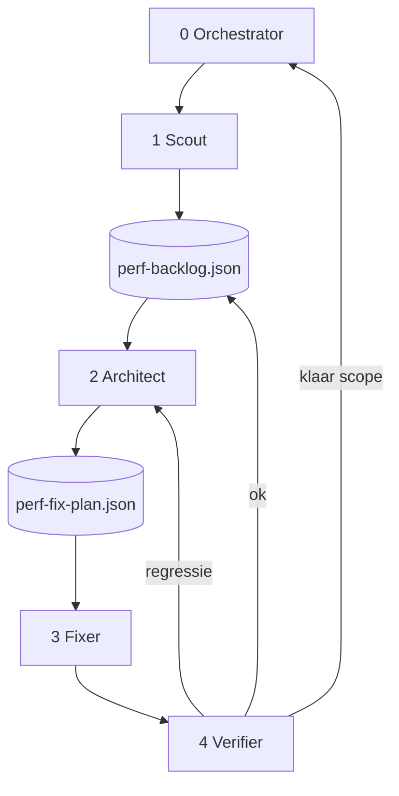

# Autonome perf-agent pipeline — voorstel

> **Status:** concept voor teamreview — nog niet geïmplementeerd  
> **Auteur:** AI-assistent + Reynier (perf-review nulmeting 2026-07-20)  
> **Gerelateerd:** `.cursor/skills/perf-review/`, `test-reports/perf-baseline.json`, PR #57

---

## Doel

**De app merkbaar sneller maken voor eindgebruikers** — met name tab-switches en paginaladingen die nu “traag voelen” — door een **autonome agent-pipeline** die:

1. **Meet** waar de tijd naartoe gaat (getal + oorzaak, niet alleen “het duurt 1,2 s”)
2. **Prioriteert** op geschatte winst × gebruiksfrequentie
3. **Optimaliseert** gericht per bottleneck-type (SQL, netwerk, client, render)
4. **Verifieert** met tests + perf-regressie vóór elke commit
5. **De hele codebase systematisch afloopt** zonder handmatige tussenkomst per fix

### Succescriteria (meetbaar)

| Criterium | Baseline (Azure-referentie) | Streef na pipeline Fase 1 |
|-----------|----------------------------|---------------------------|
| PO board-load server `app` | **740 ms** warm | **≤ 500 ms** (−30%) |
| Route `/rccp` API-som | **~1084 ms** (screening 2026-07-19) | **≤ 750 ms** |
| Geen regressie op baseline-acties | — | ≤ +25% of +200 ms |
| `npm test` + `npm run build` | groen | altijd groen na elke agent-commit |
| Coverage user journeys | deels gemeten | 100% routes/tabs in baseline |

### Niet-doel

- Productie-deploy zonder menselijke PR-review (pipeline levert branch + rapport)
- Absolute ms-budgetten verzinnen zonder baseline
- UX-wijzigingen zonder expliciet beleid (paginering, stale data > 60 s)
- Vervanging van functionele tests — perf ≠ correctheid

---

## Huidige situatie (wat we al hebben)

### Meetinstrumentatie (in de app)

| Laag | Mechanisme | Locatie |
|------|------------|---------|
| Frontend interacties | Event Timing, Long Animation Frames | `src/utils/perf.js` → `window.__perf` |
| API-calls | Duur + pad logging | `src/utils/api.js` → `[api] GET … in Xms` |
| Client-berekening | `measure()` | `src/utils/perf.js` |
| Backend SQL/suboperaties | Server-Timing headers | `server/utils/timing.js` → `time('tb_*', …)` |
| Perf-HUD | Dev/preview only | `DevPerfOverlay` in `App.jsx` |

### Skill + tooling

| Onderdeel | Status |
|-----------|--------|
| **`perf-review` skill** | Screening, drilldown, regression; rapport + baseline |
| **`playwright/perf-screening.js`** | Headless fallback als browser-MCP ontbreekt |
| **`scripts/seed-perf-po-cache.js`** | 80 PO's seeden voor lokale board-meting |
| **`test-reports/perf-baseline.json`** | Nulmeting 2026-07-20 + Azure-referentie |
| **`test-reports/perf-review-2026-07-20.md`** | Rapport met bevindingen B1–B3 |

### Belangrijkste bevindingen nulmeting

| Actie | Server `app` | Wandklok | Bottleneck |
|-------|-------------:|---------:|------------|
| PO board-load (80 PO's, local SQL) | 95 ms | 1779 ms | **Render/DOM** (lokaal) |
| PO board-load (Azure-referentie) | **740 ms** | — | **SQL** (`tb_ledger`, `tb_read_details`, `tb_lookups`) |
| Route `/rccp` | 179 ms | 860 ms | **Duplicate PO-read** (`rccp_po_read`) |
| Admin Analytics | 62 ms | 980 ms | **Netwerk/waterfall** (~12 API-calls) |

**Conclusie:** één simpele “dominant = SQL”-beslisboom is **onvoldoende** — gap-analyse (wandklok vs. server) is verplicht.

### Wat ontbreekt

- Autonome fix-loop (perf-review stopt bewust bij **voorstel**)
- Machine-leesbare backlog (`perf-backlog.json`)
- Fix-beleid voor trade-offs (cache, stale data, indexen)
- Orchestrator + verify-agent
- Meting op **DEV/preview met Azure SQL** (preview.yml triggert alleen `feature/**`)

---

## Voorgestelde aanpak: 5 agents + orchestrator



### Agent 0 — Orchestrator

**Rol:** state machine; geen code-wijzigingen.

- Beheert **scope-queue** (welk deel van de codebase nu aan de beurt is)
- Kiest volgende backlog-item op `estimatedGain × frequency`
- Stopt bij: backlog leeg, winst < drempel, max iteraties
- Escalatie: na 2 mislukte pogingen → item `skipped`

**Artifact:** `test-reports/perf-pipeline-state.json`

### Agent 1 — Scout (Diagnost)

**Basis:** bestaande `perf-review` skill.

| Modus | Wanneer |
|-------|---------|
| `screening` | Nieuwe scope (routes/tabs/cluster) |
| `drilldown` | Render/client dominant, geen hotspot |
| `regression` | Aangeroepen door Verifier |

**Output:** `test-reports/perf-backlog.json` — prioriteitenlijst met metingen, dominante post, labels, code-locatie, geschatte winst.

**Wijzigt code alleen voor:** meetgaten (stap 5: `time()` / `measure()`).

### Agent 2 — Architect (Fix-planner)

**Rol:** backlog-item → concreet fix-plan met autonoom beleid.

- Doorloopt **beslisboom v2** (zie onder)
- Kiest fix-tier L0–L5 (goedkoop/laag risico eerst)
- Legt trade-offs vast in fix-plan JSON
- Geen implementatie

**Output:** `test-reports/perf-fix-plan-<id>.json`

### Agent 3 — Fixer (Implementatie)

**Rol:** exact één fix-plan uitvoeren.

- Minimale diff; bestaande conventions
- Footer-versie bump
- Commit: `perf: <titel> [B<id>]`

**Basis:** `refactor-opdracht` + label-specifieke regels per dominante post.

### Agent 4 — Verifier (Kwaliteit + regressie)

**Volgorde:**

1. `npm test`
2. `npm run build`
3. `perf-review` modus **regression** op fix-plan successCriteria
4. Optioneel: `browser-feature-test` op geraakte route

**Beslissing (autonoom):**

| Uitkomst | Actie |
|----------|--------|
| Groen + winst ≥ drempel + geen regressie | baseline bijwerken, item `done`, push |
| Geen meetbare winst | revert, Architect krijgt andere tier |
| Regressie (>+25% of >+200 ms) | revert, max 2× retry |
| Tests rood | revert, item `blocked` |

**Output:** `test-reports/perf-verify-<id>.md`

---

## Beslisboom v2 (Architect-agent)

> Vervangt de eerdere platte beslisboom (“SQL → index”). Gebaseerd op nulmeting + `perf-review/reference.md`.

### Laag 0 — Pre-flight

1. Metingen valide? (`window.__perf`, Server-Timing, 3× mediaan)
2. **Skip** als `app < 150 ms` EN `elapsedWall < 500 ms` EN frequency ≠ high
3. **Accounting:** parallelle labels → gebruik **MAX(label)**, niet SUM; bij negatieve render → max(api) i.p.v. sum

### Laag 1 — Gap-routing (waar zit de tijd echt?)

| Conditie | Tak |
|----------|-----|
| `elapsedWall − max(api) ≥ 400 ms` | **R** (render/client) |
| `max(api) − app ≥ 200 ms` | **N** (netwerk/payload) |
| `app ≥ 300 ms` + bekend label | **S** (server/SQL) |
| `app` hoog, labels ≪ `app` | **B** (backend-overig / ongemeten) |

### Laag 2 — Label-specifieke fixes (tak S)

| Label | Eerste hefboom |
|-------|----------------|
| `tb_ledger` | Ledger-venster verkleinen (sinceMs / viewed baseline) |
| `tb_read_details` | Query scope; rowcount > 50k → ontwerp (L5) |
| `tb_lookups` / `tb_lookup_*` | N+1 batch; materialiseren bij sync (L4) |
| `rccp_po_read` / `rccp_vendor_list` | Revision-cache delen met board (L2) |
| `tb_build_rows` | Backend-JS projectie — geen SQL-index |
| `bi_meta` / `bi_aggregate` | Pre-aggregate bij sync of TTL-cache (L2–L4) |

**Regel:** bij parallelle labels → **één label per iteratie** (critical path).

### Laag 2 — Tak N (netwerk)

1. Duplicate requests (zelfde path ≥2×) → in-flight dedupe (L1)
2. Waterfall → `Promise.all` (L2)
3. Grote payload (>500 KB) → kolomselectie (L3)
4. Revision skip faalt → revision-fix (L1)

### Laag 2 — Tak R (render/client)

1. Longframe met bron → fix die functie (L2)
2. Geen bron + board >100 rijen → virtualisatie (L4–L5)
3. Diffuus → React Profiler drilldown (L0), daarna opnieuw meten

### Laag 2 — Tak B (backend-overig)

- Route zonder `time()` → L0 instrumentatie, **geen optimalisatie-gok**

### Fix-tiers (volgorde)

| Tier | Voorbeeld | Risico |
|------|-----------|--------|
| L0 | `time()`, `measure()`, Profiler | Geen |
| L1 | Dedupe, revision skip | Laag |
| L2 | Memo, `Promise.all`, TTL-cache 30 s | Laag |
| L3 | Query scope, ledger window | Medium |
| L4 | Index, sync-materialisatie | Medium–hoog |
| L5 | Virtualisatie, paginatie-UX, ADR | Hoog |

Tier ≥ L4 → Verifier test **alle** baseline-acties.

---

## Scope-queue (hele codebase)

```
Fase 1 — User journeys (screening)
  /           → board-load, tabs Charts/RCCP
  /rccp       → dashboard load
  /bi         → charts load
  /admin      → Users, Analytics, OData, Data model (+ sub-tabs)

Fase 2 — Backend hotspots
  Alle time()-labels uit reference.md zonder recente baseline
  TableDataService.read(), RccpAnalysisService, bi-routes

Fase 3 — Drilldown
  Items met dominant render/client zonder longframe-hit

Fase 4 — Structuur (Architect-only scan)
  Components >250 regels in hot paths
  Raw fetch buiten apiRequest
  Hooks met 5+ useState in board/supplier
```

Per fase: Scout vult backlog → items af tot leeg → volgende fase.

---

## Artifacts (contract tussen agents)

| Bestand | Producer | Inhoud |
|---------|----------|--------|
| `perf-pipeline-state.json` | Orchestrator | fase, iteratie, huidig item |
| `perf-backlog.json` | Scout | prioriteiten + metingen |
| `perf-baseline.json` | Scout / Verifier | mediaan per actie (regressie) |
| `perf-fix-plan-<id>.json` | Architect | approach, tier, files, successCriteria |
| `perf-verify-<id>.md` | Verifier | test + regression resultaat |
| `perf-optimize-policy.json` | Team (vast) | autonome grenzen |
| `perf-review-<datum>.md` | Scout | menselijk rapport |

---

## Autonoom beleid (`perf-optimize-policy.json` — concept)

```json
{
  "skipIf": { "appMs": 150, "elapsedWallMs": 500 },
  "gapRouting": {
    "renderIfElapsedMinusApiMsGte": 400,
    "networkIfApiMinusAppMsGte": 200,
    "serverIfAppMsGte": 300
  },
  "cache": { "maxStaleSeconds": 30, "requireRevisionInvalidation": true },
  "regression": { "thresholdPercent": 25, "thresholdMs": 200 },
  "retry": { "maxAttemptsPerItem": 2, "maxTierBeforeSkip": 3 },
  "stop": { "maxIterationsPerRun": 50, "minGainMsToContinue": 20 },
  "environment": {
    "preferPreviewOrDev": true,
    "seedScriptFallback": "scripts/seed-perf-po-cache.js"
  }
}
```

---

## Uitvoering & Git

| Aspect | Keuze |
|--------|-------|
| Branch | `perf/autonomous-<datum>` of `feature/<id>-perf-pipeline` |
| Commits | 1 fix per commit; revert bij falen |
| Push | Na elke geslaagde verify (cloud agent) |
| PR | Menselijke review vóór merge naar `develop` |
| Omgeving meten | **DEV/preview** (Azure SQL); lokaal alleen met seed |

### Pipeline-loop (pseudo)

```
WHILE backlog not empty AND iterations < max:
  item = pop highest (gain × frequency)
  plan = Architect(item)          // beslisboom v2
  IF plan.tier == L0: Fixer → Verifier regression → CONTINUE
  commit = Fixer(plan)
  result = Verifier(plan.criteria)
  IF ok: update baseline, mark done
  ELIF regression: revert, retry Architect (attempt++)
  ELSE: skip item
END
write summary report
```

---

## Fasering (implementatie + rollout)

### Fase A — Foundation (review + bouw skills)

- [ ] Teamreview dit plan
- [ ] `perf-optimize-policy.json` + `perf-backlog.schema.json`
- [ ] Skills: `perf-orchestrate`, `perf-architect`, `perf-optimize`, `perf-verify`
- [ ] `scripts/perf-pipeline-run.js` — entrypoint voor cloud agent

### Fase B — Pilot (max 10 iteraties)

- [ ] Alleen Fase 1 user journeys
- [ ] Meting op DEV Container App URL
- [ ] Doel: pipeline stabiel (geen regressies, minstens 1 aantoonbare winst)

### Fase C — Uitbreiding

- [ ] Fase 2 backend hotspots
- [ ] Fase 3 drilldown
- [ ] Fase 4 structuur (optioneel)

### Fase D — ADR + DevOps

- [ ] ADR voor architectuurkeuzes (cache, virtualisatie, indexen)
- [ ] Optioneel: DevOps Feature + work items per fase

---

## Risico's en mitigatie

| Risico | Mitigatie |
|--------|-----------|
| Verkeerde laag geoptimaliseerd | Gap-routing + label-specifieke tak |
| Stale/onjuiste data door cache | Policy: max 30 s + revision-invalidatie |
| Oneindige loop | max attempts, skip, stop-criteria |
| Lege DB / geen meting | Seed-script of verplicht DEV-URL |
| UX breekt | browser-feature-test + npm test |
| Te grote PR | 1 fix per commit |
| Lokaal meten, prod concluderen | DEV/preview verplicht voor absolute ms |
| Agent fix zonder winst | revert + volgende tier |

---

## Te bouwen skills (samenvatting)

| Skill | Gebaseerd op | Nieuw? |
|-------|--------------|--------|
| `perf-review` | bestaand | Scout gebruikt as-is |
| `perf-orchestrate` | — | **nieuw** |
| `perf-architect` | beslisboom v2 | **nieuw** |
| `perf-optimize` | `refactor-opdracht` | **nieuw** |
| `perf-verify` | `perf-review regression` + `browser-feature-test` | **nieuw** |

---

## Open vragen voor reviewers

1. **Autonomie-grens:** tier L4+ (index, materialisatie) zonder mens — akkoord?
2. **Stale-data:** max 30 s cache — acceptabel voor board/RCCP?
3. **Stop-criterium:** −30% op PO board-load voldoende, of hoger/lager?
4. **Omgeving:** pilot op DEV Container App — wie levert test-credentials/URL?
5. **PR-review:** blijft verplicht vóór merge — ok?
6. **Scope Fase 4:** structurele refactors (grote components) in scope of apart tech-debt traject?
7. **Preview-trigger:** `cursor/**` branches triggeren geen preview.yml — feature-branch prefix nodig?

---

## Referenties

- Plan nulmeting: `test-reports/perf-review-2026-07-20.md`
- Baseline: `test-reports/perf-baseline.json`
- Skill: `.cursor/skills/perf-review/SKILL.md`
- Labelinventaris: `.cursor/skills/perf-review/reference.md`
- Playwright screening: `playwright/perf-screening.js`
- Seed: `scripts/seed-perf-po-cache.js`
- PR nulmeting: https://github.com/reyniervanbommel-commits/vanbommel-app-template/pull/57

---

## Review-checklist (voor collega's)

- [ ] Doel en succescriteria helder en realistisch?
- [ ] Vijf agent-rollen logisch gescheiden?
- [ ] Beslisboom v2 dekt jullie bekende bottlenecks (board, RCCP, admin)?
- [ ] Autonoom beleid (`perf-optimize-policy.json`) veilig genoeg?
- [ ] Fasering B–C haalbaar zonder team-blocker?
- [ ] Open vragen beantwoord / aangevuld?
