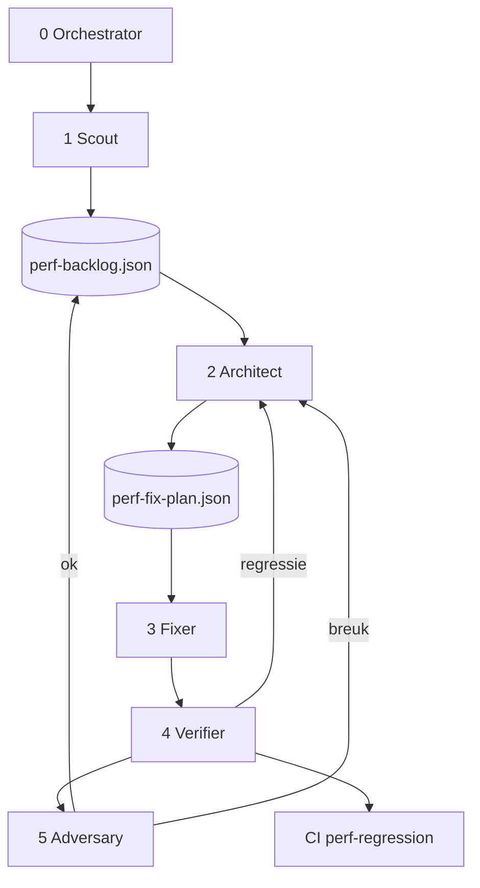

# Autonome perf-agent pipeline — voorstel v1.1

> **Status:** concept voor teamreview — v1.1 na kritische review  
> **Auteur:** AI-assistent + Reynier (perf-review nulmeting 2026-07-20)  
> **Wijziging v1.1:** ervaren snelheid primair, schaal-profielen, adversary-agent, CI-gate, v1-scope beperkt  
> **Gerelateerd:** `.cursor/skills/perf-review/`, `test-reports/perf-baseline.json`, PR #57

---

## Doel

**De app merkbaar sneller maken voor eindgebruikers** — wat mensen *voelen* bij tab-switches en paginaladingen — via een autonome agent-pipeline die:

1. **Meet** waar de tijd naartoe gaat (wandklok + server, niet alleen `app`)
2. **Prioriteert** op `(geschatte UX-winst) × werkelijke route-frequency` (analytics)
3. **Optimaliseert** gericht per bottleneck (SQL, netwerk, client, render)
4. **Verifieert** met tests + perf-regressie op **twee schaal-profielen**
5. **Breekt** fixes bewust (adversary) vóór push
6. **Beveiligt** via CI-regressie op elke PR

### Prioriteitsformule

```
priority = (elapsedWall_median − targetWall) × routeFrequencyWeight
```

- `routeFrequencyWeight` uit **`/admin/analytics/page-usage`** (fallback: handmatige high/medium/low)
- Bij tie-break: hogere `app` wint (backend-kosten)

### Succescriteria — dual targets (v1.1)

| Actie | Metric | Baseline | Primair streef (UX) | Secundair streef (server) |
|-------|--------|----------|---------------------|---------------------------|
| PO board-load | **elapsedWall** | ~1779 ms (local 80 PO) / TBD Azure | **−30%** wandklok | — |
| PO board-load | **server `app`** | **740 ms** (Azure warm) | — | **≤ 500 ms** (−30%) |
| Route `/rccp` | **elapsedWall** | 860 ms (local) | **−25%** | — |
| Route `/rccp` | **apiSum** | ~1084 ms (Azure) | — | **≤ 750 ms** |
| Terugkeer `/` na `/rccp` | **duplicate PO-read** | 2× identieke call | **1×** | — |

**Regressie (beide metrics):** ≤ +25% of +200 ms t.o.v. baseline — **UX-metric en server-metric apart**.

### Niet-doel (v1)

- Hele codebase in één run (Fase 4 structuur = apart epic)
- Productie-deploy zonder PR-review
- Optimaliseren op seed-profiel **S** alleen (80 PO) als enige waarheid
- Perf zonder functionele correctheid (change-indicators, supplier-scope)

---

## Lessons learned nulmeting (waarom v1.1)

| Bevinding | Gevolg voor plan |
|-----------|------------------|
| Local: `app` 95 ms, wandklok 1779 ms | **UX-metric primair** — SQL-fix alleen is onvoldoende |
| Azure: `app` 740 ms, labels SQL | Server-metric blijft secundair streefdoel |
| 80 PO seed ≠ prod-volume | **Profielen S/M/L** verplicht |
| `/rccp` herhaalt PO-read | v1-journey: **terugkeer naar board** expliciet meten |
| Frequency was geraten | **Route analytics** koppelen |

---

## Voorgestelde aanpak: 6 agents + orchestrator



### Agent 0 — Orchestrator

- Scope **v1 beperkt** tot 3 kritieke journeys (zie onder)
- Priority: `(UX-winst) × analytics-frequency`
- Meet-profiel: Scout op **M**, Verifier op **S + M**, Adversary op **M**
- L5-fixes (virtualisatie): pas na meting op profiel **L**
- Push **alleen** na Verifier + Adversary groen
- Partial re-measure: na fix alleen **blast radius** (geraakte actie + buren), geen volledige re-screen

**Artifact:** `test-reports/perf-pipeline-state.json`

### Agent 1 — Scout (Diagnost)

**Basis:** `perf-review` skill.

| Modus | Wanneer |
|-------|---------|
| `screening` | Nieuwe scope / profiel M |
| `drilldown` | Render dominant, geen longframe |
| `regression` | Verifier / CI |

**Frequency:** haalt weights uit `GET /admin/analytics/page-usage` (via test-account) → `perf-backlog.json`.

**Seed / omgeving:**

| Profiel | PO's | Gebruik |
|---------|-----:|---------|
| **S** | 80 | Snelle iteratie, CI smoke |
| **M** | 500 | Scout + Adversary (default) |
| **L** | 2000 | L4/L5 stress; optioneel v2 |

**Output:** `perf-backlog.json` met `elapsedWall`, `app`, `apiSum`, dominant post, labels, `priorityScore`.

### Agent 2 — Architect

- Beslisboom v2 + **gap-routing eerst** (R vóór S als wandklok-dominated)
- Fix-plan met **dual successCriteria** (`elapsedWall` + `app`/`apiSum`)
- `functionalInvariants`: bv. "change-indicators blijven zichtbaar", "supplier ziet alleen eigen PO's"

**Output:** `perf-fix-plan-<id>.json`

### Agent 3 — Fixer

- Eén fix-plan; tier L0→L5
- Geen push — commit lokaal tot Adversary groen

### Agent 4 — Verifier

1. `npm test` + `npm run build`
2. `perf-review regression` op **profiel S** (smoke)
3. `perf-review regression` op **profiel M** (beslissend)
4. `browser-feature-test` op geraakte route
5. Check **functionalInvariants** uit fix-plan

| Uitkomst | Actie |
|----------|--------|
| Groen + UX-winst ≥ drempel | door naar Adversary |
| Geen UX-winst | revert → Architect volgende tier |
| Regressie UX **of** server | revert → retry (max 2×) |
| Tests rood | revert → `blocked` |

### Agent 5 — Adversary (nieuw v1.1)

**Doel:** perf-fixes breken die Verifier mist.

Standaard-scenario's (Playwright):

| # | Scenario | Waarom |
|---|----------|--------|
| A1 | 2 tabs: `/` + `/rccp` parallel | duplicate-read / cache |
| A2 | Supplier-login na admin-fix | scope-lek |
| A3 | Hard refresh board tijdens load | race / stale |
| A4 | Terugkeer `/` binnen 30 s na board-load | TTL-cache / revision |
| A5 | Ledger-fix: kunstmatige D365-wijziging → indicator zichtbaar? | stale-indicators |

**Output:** `test-reports/perf-adversary-<id>.md` — alleen bij **pass** mag Orchestrator pushen.

---

## Beslisboom v2 (Architect) — ongewijzigd kern, extra regel

**Nieuwe regel v1.1:** als `elapsedWall − max(api) ≥ 400 ms` → tak **R** heeft **voorrang** boven SQL-labels, ook als `app` hoog is op Azure.

*(Laag 0–2, fix-tiers L0–L5: zie v1.0 — ongewijzigd.)*

Tier ≥ L4 → Verifier op **S + M**; Adversary verplicht; menselijke PR-review **altijd**.

---

## Scope v1 (pilot) — bewust smal

```
Journey 1 — PO board-load (/)
  hard reload, 80/500 PO profiel, board zichtbaar

Journey 2 — RCCP (/rccp)
  dashboard load, rccp_po_read labels

Journey 3 — Terugkeer board na RCCP
  / → /rccp → / ; meet duplicate PO-fetch
```

**Na v1 succes:** uitbreiden naar `/bi`, `/admin`, Fase 2 backend hotspots, Fase 3 drilldown.

**Fase 4 (structuur, virtualisatie L5):** apart tech-debt epic — niet in autonome v1-loop.

---

## CI-gate (nieuw v1.1)

Workflow `perf-regression.yml` (concept):

- Trigger: PR naar `develop`
- Profiel **S** seed + Playwright screening
- Vergelijk met `test-reports/perf-baseline.json`
- Fail PR bij regressie UX **of** server op v1-journeys
- Cloud-agent pipeline en CI delen **dezelfde baseline**

---

## Artifacts

| Bestand | Producer |
|---------|----------|
| `perf-pipeline-state.json` | Orchestrator |
| `perf-backlog.json` | Scout (+ analytics weights) |
| `perf-baseline.json` | Scout / Verifier (per profiel S/M) |
| `perf-fix-plan-<id>.json` | Architect |
| `perf-verify-<id>.md` | Verifier |
| `perf-adversary-<id>.md` | Adversary |
| `perf-optimize-policy.json` | Team (MC-beslissingen) |
| `perf-review-<datum>.md` | Scout |

---

## Autonoom beleid (concept — velden ingevuld na MC-vragen)

```json
{
  "primaryMetric": "elapsedWall",
  "secondaryMetric": "app",
  "scaleProfiles": { "S": 80, "M": 500, "L": 2000 },
  "scoutProfile": "M",
  "verifyProfiles": ["S", "M"],
  "skipIf": { "elapsedWallMs": 500, "appMs": 150, "unlessAnalyticsTopN": 5 },
  "gapRouting": {
    "renderIfElapsedMinusApiMsGte": 400,
    "networkIfApiMinusAppMsGte": 200,
    "serverIfAppMsGte": 300
  },
  "cache": { "maxStaleSeconds": "TBD", "requireRevisionInvalidation": true },
  "autonomyMaxTier": "TBD",
  "regression": { "thresholdPercent": 25, "thresholdMs": 200, "bothMetrics": true },
  "retry": { "maxAttemptsPerItem": 2 },
  "stop": { "maxIterationsPerRun": 10, "minUxGainMs": 50 },
  "frequencySource": "/admin/analytics/page-usage",
  "environment": { "truth": "TBD", "seedScript": "scripts/seed-perf-po-cache.js" }
}
```

---

## Pipeline-loop (v1.1)

```
WHILE backlog not empty AND iterations < max:
  item = highest priorityScore
  plan = Architect(item)
  commit = Fixer(plan)                    // lokaal, geen push
  IF NOT Verifier(plan, profiles S+M): revert; CONTINUE
  IF NOT Adversary(plan.scenarios): revert; CONTINUE
  push; update baseline; mark done
  partial re-measure blast radius only
END
```

---

## Fasering

### Fase A — Foundation

- [ ] MC-beslissingen product-owner (chat)
- [ ] Policy JSON + backlog schema + seed M/L
- [ ] Skills: orchestrate, architect, optimize, verify, **adversary**
- [ ] CI workflow perf-regression.yml

### Fase B — Pilot v1

- [ ] 3 journeys, profiel M, max 10 iteraties, DEV-URL
- [ ] Minstens 1 UX-winst + 1 server-winst aantoonbaar
- [ ] 0 adversary-fails on pushed commits

### Fase C — Uitbreiding (na v1)

- [ ] `/bi`, `/admin`, profiel L voor L5
- [ ] Continue cloud-agent schedule (optioneel)

### Fase D — ADR + DevOps

- [ ] ADR cache/virtualisatie/index
- [ ] DevOps Feature

---

## Risico's (v1.1)

| Risico | Mitigatie |
|--------|-----------|
| SQL fix, UX unchanged | elapsedWall primair + gap-routing |
| Fix werkt op 80 PO, faalt op 500 | Profiel M verplicht |
| Stale indicators | Adversary A5 + functionalInvariants |
| Agent bias | Adversary-agent |
| Baseline drift | CI + shared baseline.json |
| Analytics leeg (dev) | Fallback frequency weights in policy |

---

## Te bouwen skills

| Skill | Nieuw? |
|-------|--------|
| `perf-review` | bestaand → Scout |
| `perf-orchestrate` | **nieuw** |
| `perf-architect` | **nieuw** |
| `perf-optimize` | **nieuw** |
| `perf-verify` | **nieuw** |
| `perf-adversary` | **nieuw v1.1** |

---

## Beslissingen — invullen via multiple choice (product-owner)

Zie chat-vragen Q1–Q12. Antwoorden worden verwerkt in `perf-optimize-policy.json` en succescriteria.

---

## Referenties

- Nulmeting: `test-reports/perf-review-2026-07-20.md`
- Baseline: `test-reports/perf-baseline.json`
- Analytics: `src/hooks/useRouteAnalytics.js`, `useAnalyticsData.js`
- Seed: `scripts/seed-perf-po-cache.js`
- PR #57

---

## Changelog

| Versie | Wijziging |
|--------|-----------|
| v1.0 | Initieel 5-agent voorstel |
| v1.1 | UX primair, adversary, S/M/L profielen, CI, v1-scope, analytics frequency, partial re-measure |
