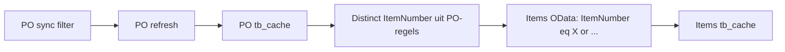
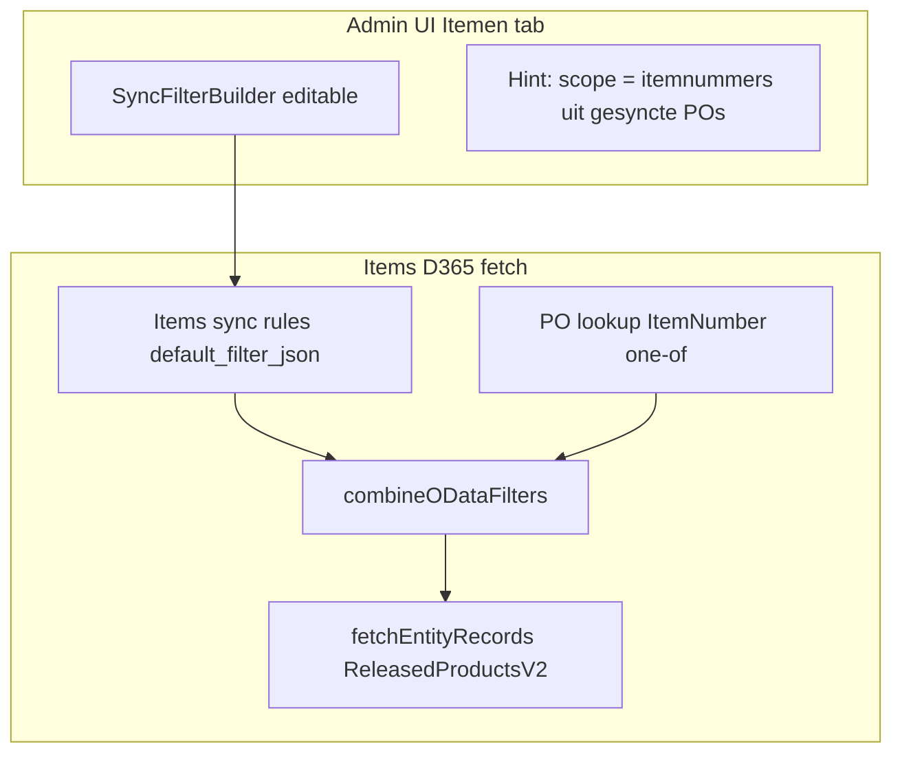

# Plan: Items sync filter met PO-koppeling

## User story

Als admin wil ik op de Itemen-tab een eigen D365-syncfilter kunnen instellen,
zodat ik binnen de PO-scope alleen de relevante items synchroniseer.

## Acceptatiecriteria

- Itemen-tab toont een bewerkbare filterbuilder (Add/Save/Count), niet "Inherited".
- Vendors en product-receipt-lines blijven ongewijzigd read-only inherited.
- Opgeslagen items-regels worden bij de volgende items-sync als OData `$filter`
  toegepast, gecombineerd (AND) met de PO-lookup-scope op `ItemNumber`.
- Zonder itemnummer in de PO-cache wordt geen item opgehaald, ongeacht het filter.
- "Count rows" op de Itemen-tab toont het aantal items dat na sync binnenkomt
  (items-filter AND PO-scope), niet de ruwe D365-itemcount.
- Een Engelse hint legt de PO-scope uit.

---

## Antwoord op de vraag over "inheritance"

De huidige situatie is **niet** dat items de PO `$filter` direct overnemen. Wat er wél gebeurt:

**Nadelen / vertraagd effect van het huidige model:**

| Effect | Wanneer |
|--------|---------|
| PO-filter verscherpen | Out-of-scope PO-orders worden direct `removed_at_source=1`; items-cache blijft oud tot items opnieuw synct |
| PO-filter versoepelen | Nieuwe POs komen pas na PO refresh; items volgen via cascade refresh |
| Geen secundair filter | Je kunt binnen PO-items niet filteren op bv. itemgroep, producttype |
| Misleidende UI | Tab Itemen toont "Inherited PO filter", maar het echte koppelmechanisme is lookup uit PO-cache |

**Conclusie:** De PO-koppeling via lookup-scopes is precies wat gewenst is ("alleen items uit gekozen POs"). Wat ontbreekt is een tweede laag: een eigen items-filter binnen die scope. Dat hoeft de PO-link niet te breken.

---

## Beslissingen (vastgelegd; geen open keuzes)

- `poScopeHint`: JA, vaste Engelse tekst.
- PO-filter preview: informatief tonen naast de items-filter.
- Enum-detectie generiek maken: NEE (descope). Items ondersteunt v1 alleen
  `text`/`number`/`date`; enum is een eventuele vervolg-story.
- `saveSyncFilters('items')` roept GEEN `markOutOfScopeCacheRows` aan (blijft PO-only);
  items buiten filter verdwijnen bij de volgende items-refresh.
- Minimale wijziging: geen nieuw fetch-pad. `genericMasterD365Fetch` combineert al
  `getTableSyncFilter(table)` (`extraFilter`) met de PO-`inheritedFilter` via
  `combineODataFilters`. Alleen `items` loskoppelen van de read-only-guard.

---

## Gewenste architectuur

Twee onafhankelijke lagen, gecombineerd met AND:

1. **PO lookup scope** (behouden): `ItemNumber eq 'A' or ...` — distinct waarden uit PO detail-cache (`removed_at_source = 0`)
2. **Items eigen filter** (nieuw): admin-regels op `ReleasedProductsV2`-velden, opgeslagen in `tb_tables.default_filter_json`

---

## Backend wijzigingen (`server/services/TableDataService.js`)

### 1. Splits de set + map alle call-sites

Vervang `INHERITED_PO_FILTER_TABLE_KEYS` door twee sets:

- `PO_LOOKUP_SCOPED_TABLE_KEYS`: `vendors`, `items`, `product-receipt-lines` — fetch-gedrag ongewijzigd
- `READ_ONLY_SYNC_FILTER_TABLE_KEYS`: `vendors`, `product-receipt-lines` — UI/API blijft read-only

Call-site-mapping (elk gebruik expliciet):

| Call-site (± regel) | Nieuwe set |
|---------------------|-----------|
| `getInheritedPoLookupScopes` guard (~730) | `PO_LOOKUP_SCOPED` (items blijft) |
| `genericMasterD365Fetch` `usesInheritedPoFilter` (~882) | `PO_LOOKUP_SCOPED` (items blijft) |
| `getTableSyncRules` lege-return (~806) | `READ_ONLY` (items eruit → leest `default_filter_json`) |
| `getDataModel` `isInheritedSyncFilterTable` (~4415) | `READ_ONLY` (items eruit) |
| `saveSyncFilters` block (~4574) | `READ_ONLY` (items eruit) |
| `countSyncFilter` block (~4594) | `READ_ONLY` (items eruit) |

### 2. `getTableSyncRules` / `saveSyncFilters` / `getDataModel`

| Functie | Wijziging voor `items` |
|---------|------------------------|
| `getTableSyncRules` | Valt in `parseDefaultFilterRules(table.defaultFilter)` (items niet meer in READ_ONLY-set) |
| `saveSyncFilters` | Toegestaan; schrijft `saveTableDefaultFilter` (geen `PO_SYNC_RULES`, geen `markOutOfScopeCacheRows`) |
| `getDataModel` | Editable payload (`readOnly: false`, eigen `rules`/`compiled`) + informatieve `inheritedCompiled` (PO-filter) + `poScopeHint` |

### 3. Count rows op Items-tab — nieuwe (derde) branch in `countSyncFilter`

Op de PO-tab blijft Count = aantal PO-headers (ongewijzigd). Op de Items-tab:

- Voeg een branch toe voor `PO_LOOKUP_SCOPED`-tabellen (los van de bestaande PO- en generieke branch).
- Hergebruik `getInheritedPoLookupScopes(table)` → per chunk (20) `combineODataFilters(itemsFilter, oneOfClause)` → `fetchEntityRecords({ top:1, maxItems:1 })` → som van `result.total`.
- Chunks zijn disjunct (distinct itemnummers) → sommeren is correct.
- Lege PO-scope → total 0.

### 4. Geen DB-migratie nodig

`default_filter_json` bestaat al op `tb_tables` (`011_tb_metamodel.sql`). Items start met lege regels = geen extra filter, alleen PO-scope.

---

## Frontend wijzigingen

### 1. `src/components/admin/datamodel/SyncFilterBuilder.jsx`

- Verwijder `items` uit hardcoded `isInheritedTable`; vertrouw op `syncFilter.readOnly` van de server voor vendors/product-receipt-lines.
- Engelse hint op items-tab (MessageBar/Text, geen Tooltip): *"Items are limited to item numbers on synced purchase orders. Filters below apply within that scope."*
- Toon PO-filter preview informatief (uit `syncFilter.inheritedCompiled`) naast de eigen items-filter.
- Bewaak: bestand blijft < 300 regels (nu 239). Zo niet: hint-blok extraheren naar klein subcomponent.

### 2. `src/hooks/useSyncFilters.js` + `src/components/admin/datamodel/SyncFilterRuleRow.jsx`

Items is master-only (`ReleasedProductsV2`, geen regels):
- `previewRule`/`compile` client-side: geen `PurchaseOrderLines/any(...)` voor master-only tabellen (afgeleid van `filterCatalog.line.length === 0`).
- Verberg de level-dropdown "Subitems (Lines)" wanneer er geen line-catalogus is.

---

## Gedrag na implementatie

| Actie | Effect |
|-------|--------|
| PO-filter aanpassen + PO refresh | PO-cache wijzigt → cascade refresh items → nieuwe itemnummers in scope |
| Items-filter opslaan | Volgende items-sync past extra OData-filter toe binnen PO-scope |
| Items-filter verscherpen | Items buiten filter verdwijnen bij volgende items-refresh (soft-delete) |
| Alleen items refresh | Scope = huidige PO-cache + opgeslagen items-filter |

PO-koppeling blijft intact: zonder itemnummer in PO-cache wordt geen item opgehaald, ongeacht items-filter.

---

## Tests (`server/services/TableDataService.test.js`, evt. `odataSyncFilter.test.js`)

- `saveSyncFilters('items', rules)` slaagt (nu 400).
- `getTableSyncRules('items')` leest `default_filter_json`.
- `countSyncFilter('items')` telt gecombineerd (PO-scope AND items-filter), niet ruwe items-count.
- Vendors/product-receipt-lines blijven read-only inherited (save/count → 400).

---

## Versie & scope

- `src/config/version.js`: `APP_VERSION` PATCH-bump `v1.36.1` → `v1.36.2`.
- `src/config/devTestItems.js`: test-item toevoegen (items-filter op instellingen).
- Geen wijziging aan vendors/product-receipt-lines filter-UI (blijven inherited).
- Geen wijziging aan PO-filter of PO refresh-keten.

> Opmerking: Azure DevOps MCP was niet beschikbaar tijdens uitvoering; geen work item ID.
> Branch daarom `feature/items-d365-sync-filter` (zonder numeriek id).
