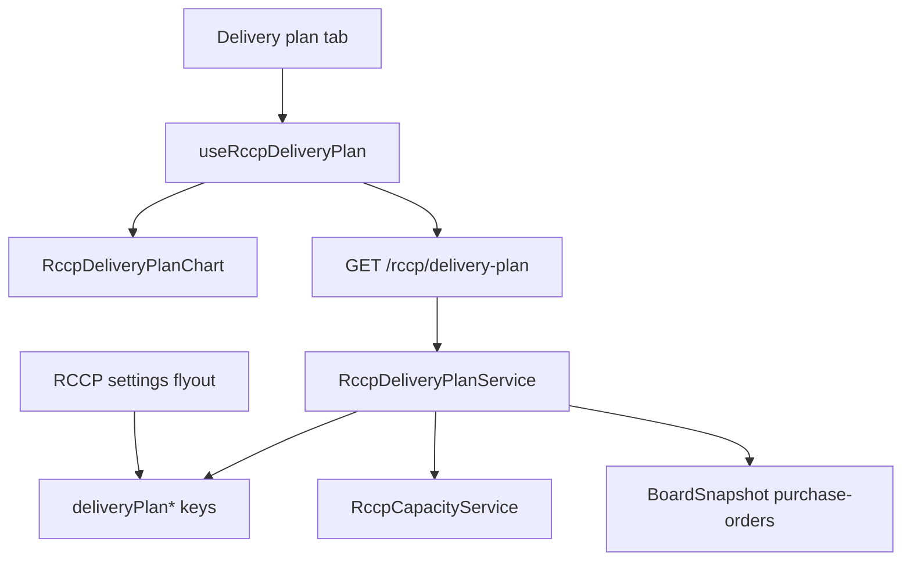

# RCCP Delivery Plan-tab

## User story

Als planner wil ik op de RCCP-pagina een extra tab zien met een wekelijkse levergrafiek per leverancier (gepland vs ontvangen vs open vs capaciteit), waarbij ik zelf kies welke PO-kolommen de geplande datum, ontvangstdatum, bestelde hoeveelheid en geleverde hoeveelheid zijn, zodat ik de nieuwe weergave kan vergelijken met het bestaande dashboard zonder dat dashboard te wijzigen.

## Beslissingen

- **Nieuwe tab**, niet vervangen. Bestaande tabs `Dashboard` en `Capacity planning` blijven. Later kan Dashboard weg als deze tab beter is.
- **Alleen live data.** Geen testdata, geen vaste capaciteit van 500.
- **Korrel = PO-regel**, niet orderkop. Live orders hebben meerdere regels met eigen datums. `orderId` = `purchaseOrderNumber|lineNumber`. Detailregel toont beide.
- **`openQty` altijd berekend:** `orderedQty - deliveredQty`. Nooit als aparte instelling.
- **`plannedDate` wordt nooit overschreven** door een ontvangstdatum.
- **UI Engels** (`Delivery plan`, `Today`, `Ordered`, `Delivered`, `Overdue`, `Over capacity`).
- **Velden kiesbaar in RCCP-instellingen** (zelfde flyout/pagina als nu), in een eigen sectie zodat het oude dashboard zijn huidige kolommen houdt.

## Veldkeuze (admin)

Nieuwe config-sectie **Delivery plan** in [RccpSettingsForm.jsx](src/components/rccp/RccpSettingsForm.jsx) / flyout. Dropdowns uit dezelfde `tb_columns` van `purchase-orders` als de bestaande Date/Vendor/measure-keuzes.

Vier sleutels in [RccpSettingsService.js](server/services/RccpSettingsService.js):

- `deliveryPlanPlannedDateKey` — datumkolom, default `requestedDeliveryDate` (zelfde fallback regel → header)
- `deliveryPlanDeliveredDateKey` — datumkolom, default `productReceiptDate` als die kolom bestaat, anders leeg
- `deliveryPlanOrderedQtyKey` — getalskolom (RCCP value column), default `quantity`
- `deliveryPlanDeliveredQtyKey` — getalskolom, default `receivedPurchaseQuantity` als die als measure/kolom bestaat, anders leeg

Lege delivered-date of delivered-qty: regel telt als nog niet geleverd (`deliveredDate = null`, `deliveredQty = 0`).

Validatie: keys moeten naar bestaande kolommen wijzen; ongeldige keys vallen stil terug naar default/leeg, net als `openMeasureKey` nu. Het oude dashboard (`dateColumnKey`, `quantityMeasures`) blijft ongewijzigd.

`RccpSettingsForm.jsx` is ~252 regels: extraheer `RccpDeliveryPlanFields.jsx` zodat beide onder 300 blijven.

## Architectuur

Data laadt **alleen als de tab actief is** en een vendor gekozen is. Geen extra call op Dashboard.

## Backend

Nieuw [server/services/RccpDeliveryPlanService.js](server/services/RccpDeliveryPlanService.js) + test ernaast.

- Hergebruik `readBoardSnapshot`, vendor-scope, `excludedStatuses`, ISO-weekhelpers uit [server/utils/isoWeek.js](server/utils/isoWeek.js).
- Map elke PO-regel naar het contract: `orderId`, `orderedQty`, `deliveredQty`, `openQty`, `plannedDate`, `deliveredDate`.
- Filter: `plannedDate` of `deliveredDate` valt in het weekvenster (anders verdwijnt een late ontvangst van een eerdere planweek).
- Capaciteit: som `availableQty` per vendor+ISO-week over alle categorieën (één lijn, zoals de mockup).
- Wrap zware stappen in `time()`.
- Endpoint `GET /rccp/delivery-plan` in [server/routes/rccp.js](server/routes/rccp.js) met dezelfde window/vendor-query als analysis. Bestaande auth/scope blijft.

Response (kern): `{ orders, weeks, weeklyCapacity, config }`. Geen fixture-orders.

## Frontend

Tab `delivery-plan` in [RccpPageContent.jsx](src/components/rccp/RccpPageContent.jsx). Zelfde vendorfilter + weekvenster als Dashboard. Settings-knop blijft beschikbaar.

Nieuwe map `src/components/rccp/delivery-plan/` (elk bestand onder 300 regels):

- `RccpDeliveryPlanTab.jsx` — lege staat, loading, error, detailregel
- `RccpDeliveryPlanChart.jsx` — Recharts `ComposedChart` met positieve planning en negatieve ontvangst
- `RccpDeliveryPlanShapes.jsx` — custom bar-shapes (opacity, rode rand achterstallig, arcering boven capaciteit, streepjes)
- `RccpDeliveryPlanOverlay.jsx` — Today-band, capaciteitslijn, één verbindingslijn achter de kolommen
- `RccpDeliveryPlanLegend.jsx` + tooltip
- `rccpDeliveryPlanModel.js` + `.test.js` — groeperen, weekkleur, delay via ISO-weekstart, overdue, totals

Hook [src/hooks/useRccpDeliveryPlan.js](src/hooks/useRccpDeliveryPlan.js): `apiRequest`, reload bij settings-save (`publishRccpSettingsSaved`) en PO-revisie.

Grafiekgedrag volgt de 14-puntenbeschrijving: weekkleur = planweek; geleverd bijna transparant boven; open vol; achterstallig rode stroke; ontvangst onderaan in leverweek met planweekkleur; `+1w`/`−1w` alleen onderaan, nooit `0w`; hover/klik één `orderId`; geen lijn als `deliveredDate` null.

## Buiten scope

- Dashboard-grafiek/matrix niet wijzigen of verwijderen
- Testdata / hardcoded 500
- Wijzigen van `plannedDate` in D365 of op het PO-board

## Acceptatiecriteria

1. Derde tab **Delivery plan** op `/rccp`; Dashboard en Capacity planning ongewijzigd.
2. Admin kiest de vier bronkolommen in RCCP-instellingen; na Save herlaadt de tab.
3. Grafiek toont live regels van de gekozen leverancier in het weekvenster.
4. Weekkleur, segmenten, transparantie, achterstallig, ontvangstkleur, capaciteit, Today, hover/selectie en totalen kloppen met de specificatie.
5. UI-teksten Engels; `openQty` altijd berekend; `plannedDate` ongewijzigd.
6. Supplier ziet alleen eigen vendor, read-only settings.
7. Unit-tests voor mapping/ISO-delay/overdue/totals; `npm test` groen; versie in [src/config/version.js](src/config/version.js) verhoogd.

## DevOps-structuur

**Feature:** RCCP Delivery Plan chart tab

**Child User Stories:**

- **Settings + API** — vier kolomkeuzes in RCCP-config, `GET /rccp/delivery-plan`, mapping + capaciteitssom, tests
- **Tab + grafiek** — tab, Recharts dual-axis, kleuren/status/capaciteit/Today
- **Interactie + afronding** — hover/selectie/lijn/detail/tooltip, docs, versie

**Tags:** `rccp; delivery-plan; chart; settings`
