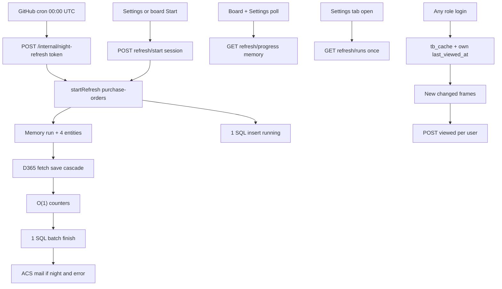

# D365 refresh — inzicht, night job en Seen (samengevoegd)

Bronnen: night-refresh-plan + D365 refresh-inzicht (samengevoegd 2026-08-21).

## Beslissingen (vastgelegd)

- **Eén run** start via bestaande `POST /api/data/purchase-orders/refresh/start` en cascade naar vendors, items, product-receipt-lines. Geen vier losse `startRefresh`-jobs.
- Handmatige Start (Settings + board) en de **nachtwekker** starten diezelfde run. Tweede pad is alleen auth (sessie vs token), niet een tweede refresh-motor.
- Wekker: **GitHub Actions cron** 00:00 UTC, alleen productie. Geen Logic App / altijd-aan replica.
- Iedereen ziet verse cache + new/changed-kaders tot hij zelf **Mark as seen** klikt. Geen admin-goedkeuring.
- Settings-tab toont live voortgang (geheugen) en historie (SQL). Counts = cache-rijen inserted/updated/removed-from-cache, niet ledger-events.
- Fouten: digest-mail via bestaande ACS **alleen bij night `error` of `interrupted`**. Handmatige Start-fout: geen mail. ACS-fout na succes: run blijft `done`.
- Cascade-volgorde: **bestaande PO-eerst**, daarna vendors/items/receipts. Niet omdraaien.
- Tab: employee ziet live/historie; Start en alert-emails alleen admin.
- Ledger-kaders: per-user Seen, venster **max 14 dagen**.
- Board-progress: slanke JSON. Settings: volle snapshot. Geen tweede live-endpoint.
- Night-HTTP: fail-closed token, alleen production, rate-limit, header-only. Al running → `attached`.
- Suppliers: `POST /purchase-orders/viewed` op de allowlist; geen `refresh/start`.

## Conflicten — beslecht

1. Cascade-volgorde → **PO eerst** (bestaande `refresh()` + inzicht-plan).
2. Mail → **alleen nachtjob-fout**.
3. Rechten → employee mag kijken; Start en e-mails admin (inzicht-plan).

## Waar de plannen niet matchten (en hoe gemerged)

- **Twee Settings-pagina’s** → één sidebar **D365 refresh**. Night-(i), alert-emails en last-run horen bij dezelfde operatie-tab, niet bij Data model of OData.
- **Vier sequentiële night-starts vs één cascade-run** → één run. Anders klopt “1 parent + 4 entities”, de boardknop en de history-lijst niet. Interne night-route roept dezelfde seed/`startRefresh('purchase-orders')` aan.
- **Eigen last-run-tabel vs `tb_refresh_runs`** → geen tweede last-run. Night last-run = laatste rij in `tb_refresh_runs` (filter `source=night` voor de Settings-regel). Historie toont alle runs.
- **`GET /internal/night-refresh/status` vs progress-snapshot** → GitHub pollt een token-beveiligde status die **dezelfde** in-memory snapshot teruggeeft (`run` + `entities`). Geen SQL-poll tijdens de run.
- **`triggered_by_user_id` alleen** → uitbreiden: `source` (`manual` | `night`), `triggered_by_user_id` nullable (null bij night).
- **Kwaliteitspoort UI** — inzicht eist `ui-design-review` (3+ UI-bestanden + ProgressBar). Night zei “niet tenzij het groeit”. Gemerged: **wél** `ui-design-review`.
- **TableDataService niet opblazen** — inzicht wint. Night-logica in `RefreshRunService` + kleine internal-route, geen extra 200 regels in de 5000-regels service.
- **Inzicht “geen tweede start-pad”** vs night token-start — tweede *HTTP-ingang*, zelfde service. Nodig omdat GitHub geen cookie heeft.

## Resultaat: data voor iedereen, kaders tot Seen

Lezen uit `tb_cache`. Iedereen (admin, medewerker, vendor) ziet verse rijen. Vendor-scoping blijft.

Nu is “gezien” een **admin-baseline** (`MAX(last_viewed_at)` van admins, `POST .../viewed` admin-only, `canMarkViewed={isAdmin}`).

Nieuw:

- Baseline = `tb_user_view_state` van **deze** user.
- Iedereen met bordtoegang mag Mark as seen. Inloggen telt niet. Voor suppliers: expliciet `POST /purchase-orders/viewed` toestaan in [`dataAccess.js`](server/middleware/dataAccess.js) — zonder die regel blijft Seen 403. Niet openzetten voor andere tableKeys of voor `refresh/start`.
- Drie dagen niet Seen = drie nachten kaders bij elkaar. Geen daglabel.
- Als `last_viewed_at` bestaat, wint die van `last_full_sync_at` (read, details, ledger-window, revision `userViewedAt`). Night/manual sync wist geen ongeziene dagen. Ledger-read is begrensd op **max 14 dagen** (snelheid).
- Eerste keer (nog nooit Seen): fallback `last_full_sync_at`.

## Harde eisen (review ronde 1+2 — bouwen, geen nazorg)

- `sinceMs = max(last_viewed_at, now - 14d)`, nooit ouder dan ledger-retentie. Zonder Seen: `last_full_sync_at`.
- `NIGHT_REFRESH_TOKEN` ontbreekt of te kort → 503, geen refresh. Alleen `APP_ENV=production`. Timing-safe compare. Geen stacks/secrets in status of mail.
- Workflow: `PROD_APP_URL` + token-header, geen Azure-login, poll 20–30s, `concurrency: night-refresh-prod` (`cancel-in-progress: false`).
- Al running → 202 `attached: true`. Mail alleen voor de night-run zelf (`error`/`interrupted`), niet bij meeliften op een geslaagde manual run.
- Mail asynchroon. ACS-fout of skip → run-status ongewijzigd; Settings mag “alert not sent” tonen.
- Process-start: `running` → `interrupted`; night daarvan mailt wél.
- Supplier allowlist: alleen `POST /purchase-orders/viewed` in [`dataAccess.js`](server/middleware/dataAccess.js) + test. Geen andere tableKeys, geen start.
- Board-serializer slank; Settings `?view=full` of staff-role. Zelfde URL, geen tweede live-API.
- Historie `limit` clamp 20. `error_text` naar employees = korte veilige zin.
- Unit tests op service/token-helper; HTTP night-start niet in localhost-E2E. Lokaal dezelfde run via Settings-Start.

## Snelheid (blijft gelden + ledger-cap)

- Live = geheugen. SQL alleen 1 insert bij start + 1 batch bij einde.
- Settings pollt niet elke 2s de history-SQL. Historie één keer bij tab-open + één keer na `done`/`error`.
- Geen extra `apiRequest` op het board. Live in het bestaande progress-endpoint.
- Counts O(1) in `persistRecordsChunk`, geen SQL in die loop.
- Optimistic UI: meteen 4 queued entity-slots.
- Board/Settings-poll alleen terwijl `running`, interval 1250 ms. GH-poll 20–30s.
- Ledger-read voor kaders: max 14 dagen terug.

## Architectuur

Migratie `scripts/db/migrations/041_tb_refresh_runs.sql` (041 is vrij):

- `tb_refresh_runs`: `id`, `started_at`, `finished_at`, `status` (`running` / `done` / `error` / `interrupted`), `source` (`manual` / `night`), `triggered_by_user_id` (null bij night), `error_text`, gedenormaliseerde totalen
- `tb_refresh_run_entities`: per tabel fetched/saved, inserted/updated/deleted (cache-rijen), status, tijden, `error_text`

Live in Maps; bij process-start `running` → `interrupted`. Index `started_at DESC`.

**Rij-counts (vast):** inserted = nieuwe cache-rij; updated = bestaande rij met veldverschil; deleted = `removed_at_source = 1` deze run. UI: `Removed from cache`, niet `Deleted in D365`. Geen backfill. `Fetched from D365` vs `Cache rows` gescheiden.

**API**

Live (geen SQL): één snapshot-helper, twee serializers:

- Board: `{ running, progress, run: { currentLabel, overall, entityIndex, entityCount } }` — geen entities-counts, geen `error_text`.
- Settings: volledige `{ run, entities }` (admin/employee, zelfde URL + `?view=full` of role=staff).

Historie: `GET /api/admin/d365-refresh/runs` — limit default/max 20, employee mag lezen, `error_text` gestript.

Night (geen sessie):

- `POST /api/internal/night-refresh` — token, fail-closed, alleen `APP_ENV=production`, wél rate-limit. Start dezelfde run met `source=night`. Al running → `attached: true`, geen tweede job.
- `GET /api/internal/night-refresh/status` — token, zelfde memory-snapshot zonder stacks. GH pollt elke 20–30s.

Settings-schrijven (admin): alert-emails in `dbo.app_settings` (`NIGHT_REFRESH_ALERT_EMAILS`).

Na finish: alleen als `source=night` en status `error` of `interrupted` → mail asynchroon. ACS-fout of ontbrekend ACS wijzigt de run-status niet. Handmatige error: geen mail. Token alleen via header.

## Frontend

Eén sidebar **D365 refresh** in [AdminPage.jsx](src/components/admin/AdminPage.jsx). Splits onder 300 regels.

- [useD365Refresh.js](src/hooks/useD365Refresh.js) — start + progress-poll; historie eenmaal
- `AdminD365Refresh.jsx` — header, (i) GitHub/Seen, Start, alert-emails + save
- `D365RefreshLivePanel.jsx` — overall + 4 entity ProgressBars
- `D365RefreshHistory.jsx` — 20 runs; night-runs herkenbaar (badge `Night`)
- Board: [PurchaseOrderRefreshProgress.jsx](src/components/supplier/PurchaseOrderRefreshProgress.jsx) — huidige stap + `run.overall`; geen insert-counts op het board
- Mark as seen voor elke rol in [PurchaseOrdersPageTopBar.jsx](src/components/supplier/PurchaseOrdersPageTopBar.jsx)

(i)-tekst (Engels), ongeveer:

> Night refresh runs once a day in production via GitHub Actions, not an Azure Logic App or always-on container. That keeps Azure cost near zero. It starts the same D365 run as the Start button. Staff and vendors see new and changed frames until they click Mark as seen — each person for themselves. The schedule is 00:00 UTC.

## GitHub workflow

[`.github/workflows/night-refresh-prod.yml`](.github/workflows/night-refresh-prod.yml): cron `0 0 * * *`, `workflow_dispatch`, `environment: production`, `concurrency: night-refresh-prod` (niet cancellen). `curl` naar `PROD_APP_URL` (secret) + `Authorization` header; geen Azure-login, geen token in URL of logs. Poll elke 20–30s tot done of ~45 min. Als de app down is: geen ACS-mail; falende GH-job is het signaal.

`NIGHT_REFRESH_TOKEN` in Key Vault + [deploy-prod.yml](.github/workflows/deploy-prod.yml) secretref. Token niet loggen (`curl -s`, geen `-v` met header).

## Kosten (bewust niet)

- Geen Logic Apps, Functions, Container Apps Jobs, `minReplicas=1` voor deze feature
- Geen nightrefresh op DEV/preview
- Geen extra mailproduct
- Geen SQL-poll of extra board-calls tijdens een run

## Kwaliteitspoort

- UI: tokens, Field/maxWidth, Engels, AdminInfoHint. **Escaleer `ui-design-review`.**
- Snelheid: geen extra board-`apiRequest`; geen SQL in persist-loop
- Security: token fail-closed + prod-only + rate-limit POST; e-mail valideren; geen secrets in mail; parameterized SQL; security-review op de interne route
- Tests: snapshot-helper (board vs full), RefreshRunService, seen-baseline + 14d-cap, dataAccess viewed-allowlist, e-mailvalidatie, token fail-closed, attached-run, mail faalt niet de run
- Versie PATCH in [src/config/version.js](src/config/version.js)

## Lokaal testen

- Settings → D365 refresh: Start toont meteen 4 rijen; balk beweegt zonder history-wait
- Network: tijdens run alleen progress-poll; `/runs` 1× open + 1× na done
- Employee: tab zichtbaar, Start en e-mailvelden disabled
- Boardknop: cascade wisselt van tekst; balk loopt door
- Mark as seen als vendor (niet 403) wist alleen eigen kaders; tweede user houdt de zijne
- Drie nachten zonder Seen: kaders blijven; na Seen weg; >14 dagen valt weg
- Network board-poll: geen `entities[]` / `error_text` in de progress-JSON
- Night-HTTP weigert buiten production; service-tests dekken token/attached/mail-niet-bij-done
- ACS-fout na successevolle night-run: status blijft done
- Geen commit/push tenzij je dat vraagt
