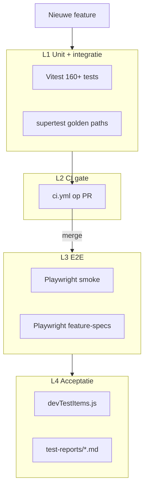

# Implementatieplan — Test suite + skills (integraal)

## Doel

Na **elke feature** reproduceerbaar kunnen testen via:

1. **Geautomatiseerde gates** — CI blokkeert broken merges
2. **Gestructureerde E2E** — Playwright suite, geen losse `live-*.js` voor nieuwe features
3. **Vaste agent-workflow** — skills + `develop-from-devops`
4. **Menselijke DEV-check** — `devTestItems.js` + testrapport

Het plan is **feature-agnostisch**: nieuwe features vullen bestaande sloten in; het raamwerk blijft stabiel.

---

## Huidige stand (baseline juli 2026)

| Onderdeel | Status |
|-----------|--------|
| Vitest | 18 bestanden, 160 tests, `npm test` lokaal groen |
| CI test-gate | **Ontbreekt** — alleen `deploy-dev.yml` health-check |
| Playwright | Alleen ad-hoc `playwright/live-conditional-formatting.js` |
| Browser-test | Skill `browser-feature-test` (MCP, handmatig/agent) |
| DEV-checklist | `src/config/devTestItems.js` (formaat: `id`, `title`, `checks[]`) |
| OTAP-test | `develop-from-devops` stap 7 → `browser-feature-test` |
| Testrapporten | `test-reports/*.md` (playwright-testopslag regel) |

**Recente features zonder feature-spec (backfill-kandidaten):**

| Feature | devTestItem | Unit tests | Playwright spec |
|---------|-------------|------------|-----------------|
| Conditional formatting | — | deels | `live-conditional-formatting.js` (migreren) |
| Cell context menu | — | `tableViewFilterUtils.test.js` | ontbreekt |
| Sync-retained orders | `feature-sync-retained-orders` | `syncRetentionSettings.test.js`, `D365ODataService.test.js` | ontbreekt |

---

## Architectuur — vier lagen



### L1 — Unit & integratie (Vitest + supertest)

**Verplicht in elke PR.**

| Type wijziging | Testlocatie | Tool |
|----------------|-------------|------|
| Pure utils | `src/utils/*.test.js`, `server/utils/*.test.js` | Vitest |
| Services | `server/services/*.test.js` | Vitest + mocks |
| Hooks/components | `src/**/*.test.js` | Vitest + jsdom + Testing Library |
| API-routes | `tests/integration/*.test.js` | supertest + test-DB of mocks |

**Nieuwe dependency:** `supertest` (devDependency).

**Golden-path API-tests (vaste regressieset, groeit langzaam):**

| # | Endpoint | Scenario |
|---|----------|----------|
| 1 | `GET /api/health` | 200 + shape |
| 2 | `POST /api/auth/login` | Bootstrap-user login + sessie-cookie |
| 3 | `GET /api/data/purchase-orders` | Read uit cache |
| 4 | `POST /api/data/purchase-orders/refresh/start` | Refresh start (mock D365) |
| 5 | `GET /api/data/purchase-orders/refresh/progress` | Progress shape |
| 6 | `POST /api/data/purchase-orders/rows/exclude` | Exclude + `sync_retained` clear |
| 7 | `PUT /api/data/purchase-orders/sync-filters` | Filter save + retention clear |

**Integratie-map:**

```
tests/
  integration/
    auth.test.js
    purchase-orders-read.test.js
    refresh.test.js
    row-exclusions.test.js
    sync-filters.test.js
    helpers/
      testApp.js       ← Express app zonder listen
      seed.js          ← vaste testdata
      db.js            ← test-DB connectie (optioneel fase 2)
```

**Dekkingsregel per feature-type (geen % coverage-doel):**

| Wijzigingstype | Minimaal |
|----------------|----------|
| Server service/utils | Unit test met mocks |
| API-route | supertest request/response |
| Hook/utils (frontend) | Vitest (+ jsdom indien nodig) |
| UI-component met interactie | `@testing-library/react` |
| Refactor zonder gedragswijziging | Bestaande tests blijven groen |

---

### L2 — CI-gate

**Nieuw bestand:** `.github/workflows/ci.yml`

```yaml
name: CI — test & build

on:
  pull_request:
    branches: [develop, main]
  push:
    branches:
      - develop
      - 'feature/**'
      - 'cursor/**'

jobs:
  test:
    runs-on: ubuntu-latest
    steps:
      - uses: actions/checkout@v4
      - uses: actions/setup-node@v4
        with:
          node-version: '22'
          cache: npm
      - run: npm ci --legacy-peer-deps
      - run: npm test
      - run: npm run build
```

**GitHub branch protection (handmatig instellen):**

- `develop`: vereis status check `test` (job uit ci.yml)
- Optioneel: vereis PR-review

**Optioneel fase 2:** MSSQL service container voor integration tests in CI.

---

### L3 — Playwright E2E

**Doel:** Smoke na elke deploy; feature-spec per PR/feature.

**Nieuwe structuur (vervangt ad-hoc `live-*.js` als primaire aanpak):**

```
playwright/
  playwright.config.js
  fixtures/
    auth.js                  # login helper + storageState
  smoke/
    app-loads.spec.js        # / redirect, geen console errors
    board-read.spec.js       # PO-board zichtbaar na login
    admin-datamodel.spec.js  # admin data model tab bereikbaar
    health.spec.js           # GET /api/health
  features/
    _template.spec.js        # kopieer per feature
    conditional-formatting.spec.js   # migratie bestaande live-script
    cell-context-menu.spec.js
    sync-retained-orders.spec.js
  screenshots/               # bij failure (playwright-testopslag regel)
  videos/
  mcp/                       # MCP-output (bestaand)
```

**package.json scripts:**

```json
"test:e2e": "playwright test",
"test:e2e:smoke": "playwright test playwright/smoke",
"test:e2e:feature": "playwright test playwright/features"
```

**Nieuwe devDependencies:** `@playwright/test`

**playwright.config.js (kern):**

- `baseURL`: `process.env.PLAYWRIGHT_BASE_URL || 'http://localhost:5178'`
- `retries`: 2 in CI, 0 lokaal
- `screenshot`: `only-on-failure` → `playwright/screenshots/`
- `video`: `retain-on-failure` → `playwright/videos/`
- `projects`: `[{ name: 'chromium' }]`
- `globalSetup`: optioneel auth storageState seed

**fixtures/auth.js:**

1. `POST /api/auth/login` met bootstrap-credentials
2. Sla `storageState` op in `playwright/.auth/admin.json`
3. Hergebruik in `test.beforeEach` via `use: { storageState }`

**Wanneer draaien:**

| Moment | Command | Target |
|--------|---------|--------|
| Lokaal / agent | `npm run test:e2e:smoke` | localhost:5178 |
| develop-from-devops stap 7 | smoke + feature grep | preview URL |
| Na merge develop | smoke (optioneel deploy-dev.yml) | DEV FQDN |
| PR CI (fase 2) | smoke only | preview URL of skip |

**Auth-strategie:** Bootstrap-user via API login in fixture; geen Microsoft OAuth in E2E.

**D365 in E2E:** niet verplicht in CI — test tegen SQL-cache state; refresh-tests mocken D365 of draaien alleen op DEV.

---

### L4 — Feature-acceptatie (mens + agent)

Per feature **vier artefacten** (verplicht vóór merge naar develop):

| # | Artefact | Locatie | Wanneer verplicht |
|---|----------|---------|-------------------|
| 1 | Unit/API tests | `**/*.test.js` | Bij logica-wijziging |
| 2 | Playwright feature-spec | `playwright/features/<slug>.spec.js` | UI of user-visible gedrag |
| 3 | DEV-checklist item | `src/config/devTestItems.js` | Altijd bij user-visible feature |
| 4 | Testrapport | `test-reports/test-report-feature-<naam>-<datum>.md` | UI-features |

**devTestItems-formaat (huidig in repo):**

```js
{
  id: 'feature-<slug>',
  title: 'Korte feature-titel',
  checks: ['Concrete check 1', 'Concrete check 2'],
}
```

Labels en checks in **Engels** (app-taal).

**Test-artefacten per feature-type:**

| Feature-type | L1 unit | L1 API | L3 smoke | L3 feature-spec | L4 devTestItem | L4 rapport |
|--------------|---------|--------|----------|-----------------|----------------|------------|
| Backend-only | ✅ | ✅ | — | — | ✅ | optioneel |
| UI component | ✅ RTL | — | ✅ | ✅ | ✅ | ✅ |
| Full-stack | ✅ | ✅ | ✅ | ✅ | ✅ | ✅ |
| Admin/config | ✅ | ✅ | ✅ | ✅ | ✅ | ✅ |
| Infra/CI only | — | — | ✅ | — | ✅ | optioneel |
| Refactor (geen gedrag) | bestaande groen | — | ✅ | — | — | — |

---

## CI/CD-wijzigingen

| Workflow | Huidig | Toevoegen |
|----------|--------|-----------|
| **ci.yml** (nieuw) | — | `npm test` + `npm run build` op PR |
| **preview.yml** | Deploy preview | Optioneel: smoke na deploy (`PLAYWRIGHT_BASE_URL`, `continue-on-error: true`) |
| **deploy-dev.yml** | Health check | Optioneel: smoke tegen DEV FQDN |
| **deploy-prod.yml** | Health check | Optioneel: read-only smoke (geen writes) |

**preview.yml smoke-stap (concept):**

```yaml
- name: Playwright smoke (optioneel)
  if: success()
  continue-on-error: true
  env:
    PLAYWRIGHT_BASE_URL: https://${{ steps.get-url.outputs.preview_url }}
    E2E_ADMIN_EMAIL: ${{ secrets.BOOTSTRAP_ADMIN_EMAIL }}
    E2E_ADMIN_PASSWORD: ${{ secrets.E2E_ADMIN_PASSWORD }}
  run: |
    npx playwright install --with-deps chromium
    npm run test:e2e:smoke
```

**D365/SQL-strategie:**

| Omgeving | Aanpak |
|----------|--------|
| CI unit | Mocks, geen live SQL |
| CI API (fase 2) | MSSQL service container + seed |
| E2E preview/DEV | Echte dev-DB + bootstrap-user |
| Productie | Alleen health + read-only smoke |

---

## Skills — aanpassen en toevoegen

> Regel uit `skills-discovery`: bestaande skills **uitbreiden**, niet dupliceren.
> Opslag: **beide** `.cursor/skills/` en `.claude/skills/`.

### 1. `develop-from-devops` — uitbreiden

**Nieuwe flow (modus `full`):**

```
Stap 5a — Implementatie (ongewijzigd)
Stap 5b — Tests schrijven (VERPLICHT):
  - npm test (unit voor gewijzigde modules)
  - feature-spec aanmaken (skill create-feature-test-spec)
  - devTestItems entry (skill add-dev-test-menu-item)
Stap 5c — Lokaal verifiëren:
  - npm test && npm run build — stop bij falen
  - npm run test:e2e:smoke (indien UI en PLAYWRIGHT_BASE_URL beschikbaar)
Stap 6a — devTestItems (blijft; nu ook in 5b gedocumenteerd)
Stap 6b–6d — Push preview (ongewijzigd)
Stap 7 — run-feature-tests tegen preview URL
  - Playwright smoke + feature-spec (@feature-<slug>)
  - Fallback: browser-feature-test MCP + rapport
Stap 8–9 — Team review (ongewijzigd)
Stap 10 — PR alleen als:
  - [ ] npm test groen
  - [ ] npm run build groen
  - [ ] feature-spec bestaat (of gedocumenteerde uitzondering)
  - [ ] devTestItems bijgewerkt
  - [ ] testrapport voor UI-features
```

**Modi:**

| Modus | Tests |
|-------|-------|
| `full` | 5b + 5c + 7 + PR-checklist |
| `preview` | 5b vóór push (geen E2E tenzij gevraagd) |
| `test` | `run-feature-tests` of `browser-feature-test` |

**Toe te voegen sectie in SKILL.md:** `## Stap 5b — Tests schrijven` en `## Stap 5c — Lokaal verifiëren`.

---

### 2. `browser-feature-test` — uitbreiden

**Nieuwe sectie: "Playwright CLI vs browser MCP"**

| Situatie | Eerste keuze |
|----------|--------------|
| Feature-spec bestaat | `npm run test:e2e:feature -- --grep @feature-<slug>` |
| Cloud VM zonder backend | Playwright tegen preview/DEV URL |
| Exploratieve UI-check | Browser MCP |
| Auth-complex / visuele edge cases | Browser MCP na Playwright |

**Toevoegen:**

- Verwijzing naar `playwright/features/<naam>.spec.js`
- Screenshots naar `playwright/screenshots/` (niet `test-reports/`)
- Rapport blijft in `test-reports/`
- Cloud-beperking: geen lokale SQL → rapport mag PARTIAL zijn met reden

---

### 3. `review-plan-for-devops` — uitbreiden

**Nieuwe checklist-items (Lens A of aparte Lens D — Testbaarheid):**

Per story in het plan:

- [ ] Unit-test verwachting benoemd (bestand + wat getest wordt)
- [ ] API golden path raakt bestaande flow (ja/nee)
- [ ] Playwright feature-spec nodig (ja/nee)
- [ ] Smoke-suite raakt core-flow (ja/nee)
- [ ] Testdata/seed impact beschreven
- [ ] Minstens één acceptatiecriterium browser-testbaar
- [ ] Puur backend-only → browser-test niet verplicht (expliciet vermelden)

**Go/no-go:** plan zonder testverwachtingen per story → 🟡 CONDITIONEEL tot aangevuld.

---

### 4. `add-dev-test-menu-item` — uitbreiden

**Wijzigingen:**

- Description: "verplicht onderdeel van develop-from-devops stap 5b/6a"
- ID-conventie: `feature-<slug>` consistent met Playwright tag `@feature-<slug>`
- Formaat bijwerken naar huidig repo-formaat (`id`, `title`, `checks[]`) — skill vermeldt nog oud QAQC-formaat
- Engels voor `title` en `checks`

---

### 5. `push-feature-to-dev` / `push-dev-to-prod` — uitbreiden

**push-feature-to-dev:**

- Vóór merge: verifieer CI-status (ci.yml groen)
- PR-body: vermeld test-artefacten (unit count, feature-spec pad, devTestItem id)
- Na DEV-deploy: optioneel `npm run test:e2e:smoke` tegen DEV URL
- DevOps-comment: CI + smoke resultaat

**push-dev-to-prod:**

- Vóór merge develop→main: CI groen op develop
- Na PROD-deploy: health + optioneel read-only smoke
- `devTestItems` legen (bestaand gedrag behouden)

---

### Nieuwe skills

#### `run-feature-tests`

**Pad:** `.cursor/skills/run-feature-tests/SKILL.md` (+ sync `.claude/skills/`)

**Description:** Voer het vaste testpakket uit na feature-implementatie: Vitest, build, optioneel Playwright smoke/feature, genereer samenvatting voor PR of testrapport.

**Triggers:** develop-from-devops stap 5c/7; "test de feature", "run tests".

**Workflow:**

1. `npm test` — stop bij falen
2. `npm run build` — stop bij falen
3. Bepaal feature-slug uit branch/plan/git diff
4. Zet `PLAYWRIGHT_BASE_URL` (lokaal / preview / DEV)
5. `npm run test:e2e:smoke` — skip met reden als geen URL
6. `npm run test:e2e:feature -- --grep @feature-<slug>` indien spec bestaat
7. Optioneel: `browser-feature-test` voor exploratief rapport
8. Schrijf `test-reports/test-report-feature-<slug>-<datum>.md`
9. Return: PASS / PARTIAL / FAIL + pad rapport

**Output-template (kort):**

```markdown
# Test summary — <feature-slug>
| Laag | Status | Detail |
|------|--------|--------|
| Vitest | PASS/FAIL | N tests |
| Build | PASS/FAIL | — |
| Smoke | PASS/FAIL/SKIP | URL |
| Feature-spec | PASS/FAIL/SKIP | @feature-<slug> |
```

---

#### `create-feature-test-spec`

**Pad:** `.cursor/skills/create-feature-test-spec/SKILL.md`

**Description:** Maak een Playwright feature-spec uit acceptatiecriteria in plan, DevOps story of devTestItems.

**Triggers:** develop-from-devops stap 5b; "maak e2e test voor feature X".

**Workflow:**

1. Lees acceptatiecriteria (plan, story, devTestItems `checks[]`)
2. Kopieer `playwright/features/_template.spec.js`
3. Schrijf `playwright/features/<slug>.spec.js`
4. Tag: `@feature-<slug>` in describe-naam
5. 3–8 scenario's: arrange (auth fixture), act, assert
6. UI-assertions in **Engels**
7. Commit in zelfde feature-branch als implementatie

**Template `_template.spec.js` structuur:**

```js
import { test, expect } from '@playwright/test';

test.describe('Feature: <name> @feature-<slug>', () => {
  test.beforeEach(async ({ page }) => {
    await page.goto('/purchase-orders');
  });

  test('AC1: <description>', async ({ page }) => {
    // arrange / act / assert
  });
});
```

---

#### `setup-test-ci` (optioneel, eenmalig)

Alleen bij expliciete vraag "richt test-CI in". Voert Fase A uit: ci.yml + Playwright install + eerste smoke.

---

## Cursor rule (nieuw)

**Bestand:** `.cursor/rules/testing.mdc`

```markdown
# Testing na elke feature

- Voer `npm test` en `npm run build` uit vóór commit/PR
- Logica-wijziging: minimaal één nieuwe/gewijzigde test
- UI/API-features: Playwright feature-spec in playwright/features/
- Werk devTestItems.js bij (skill add-dev-test-menu-item)
- UI-features: testrapport in test-reports/ (skill run-feature-tests of browser-feature-test)
- Geen merge naar develop zonder groene unit tests (CI gate)
- Skills: run-feature-tests, create-feature-test-spec
```

**Bestaande rule bijwerken:** `playwright-testopslag.mdc` — voeg `smoke/` en `features/` toe aan mappenstructuur; `live-*.js` als legacy gemarkeerd.

---

## Documentatie

**Nieuw:** `docs/guides/TESTING.md`

Inhoud:

1. Overzicht vier lagen (L1–L4)
2. Commando's (`npm test`, `npm run test:e2e:smoke`, `test:e2e:feature`)
3. Nieuwe feature-spec toevoegen (stappen + link naar `create-feature-test-spec`)
4. Test-DB seeden (`scripts/db/seed-test-data.sql`)
5. CI/preview/DEV flow
6. Waar screenshots/rapporten horen (`playwright/`, `test-reports/`)
7. Link naar skills

**Bijwerken:** `AGENTS.md` — dagelijkse commands + `npm run test:e2e:smoke`

**Bijwerken:** `BRANCH_STRATEGY.md` — PR naar develop vereist groene CI

---

## Implementatiefasering

### Fase A — Fundament (hoogste ROI)

| # | Taak | Output | Acceptatie |
|---|------|--------|------------|
| A1 | `ci.yml` | PR-gate | Rode PR kan niet mergen |
| A2 | `.cursor/rules/testing.mdc` | Merge-regel | Agents volgen rule |
| A3 | Skills `run-feature-tests`, `create-feature-test-spec` | Skeleton | Beide mappen gesync |
| A4 | `develop-from-devops` update | Stap 5b/5c/7 | Skill beschrijft flow |
| A5 | `docs/guides/TESTING.md` skeleton | Onboarding | Bestand bestaat |

### Fase B — Playwright

| # | Taak | Output |
|---|------|--------|
| B1 | `@playwright/test` + `playwright.config.js` | `npm run test:e2e` |
| B2 | `fixtures/auth.js` + 4 smoke specs | Smoke groen lokaal/DEV |
| B3 | `_template.spec.js` | Patroon vastgelegd |
| B4 | Migreer `live-conditional-formatting.js` → `features/conditional-formatting.spec.js` | Proof of concept |
| B5 | `browser-feature-test` + `develop-from-devops` update | CLI fallback |
| B6 | `playwright-testopslag.mdc` update | Nieuwe mappen |

### Fase C — API + testdata

| # | Taak | Output |
|---|------|--------|
| C1 | `supertest` + `tests/integration/` | 5–7 golden paths |
| C2 | `scripts/db/seed-test-data.sql` + `seed-test.js` | Reproduceerbare data |
| C3 | `review-plan-for-devops` update | Test-lens in plan-review |

### Fase D — OTAP smoke

| # | Taak | Output |
|---|------|--------|
| D1 | Smoke in `preview.yml` (allow-fail) | Post-preview signal |
| D2 | Smoke in `deploy-dev.yml` (allow-fail) | Post-DEV signal |
| D3 | GitHub branch protection op `develop` | CI verplicht |
| D4 | `push-feature-to-dev` / `push-dev-to-prod` update | Post-deploy verificatie |

### Fase E — Backfill bestaande features (doorlopend)

| Feature | Spec-bestand | devTestItem toevoegen |
|---------|--------------|----------------------|
| Conditional formatting | `conditional-formatting.spec.js` | ja |
| Cell context menu | `cell-context-menu.spec.js` | ja |
| Sync-retained orders | `sync-retained-orders.spec.js` | bestaat al |

Geen big-bang; één spec per sprint/feature.

---

## Toekomstbestendigheid — vaste sloten

```
Nieuw feature
  → Plan: AC + test-type (review-plan-for-devops)
  → Code + unit test (L1, verplicht CI)
  → Optioneel API test (L2, bij backend)
  → Feature-spec @feature-<slug> (L3)
  → devTestItem + testrapport (L4)
  → develop-from-devops full → PR
```

**Nieuwe feature-soort** (WebSocket, cron, nieuwe entiteit):

1. Eénmalig testpatroon toevoegen aan L1/L3
2. `run-feature-tests` skill uitbreiden
3. Documenteren in `TESTING.md`

**Wat het plan niet automatisch afdekt:**

- Discipline zonder branch protection → GitHub branch rules instellen (Fase D3)
- D365-gedrag in productie → DEV E2E blijft nodig
- OAuth in headless CI → storageState of test-route zonder auth

---

## Acceptatiecriteria plan (klaar = operationeel)

1. Elke PR naar `develop` triggert `npm test` + build in CI
2. `npm run test:e2e:smoke` draait lokaal en tegen preview/DEV
3. Template + skills voor feature-specs bestaan (beide skill-mappen)
4. `develop-from-devops` vereist test-stappen vóór PR
5. `devTestItems.js` + testrapport blijven onderdeel van OTAP
6. `docs/guides/TESTING.md` beschrijft volledige flow
7. Minimaal 3 bestaande features hebben feature-spec (backfill)
8. Geen nieuwe `playwright/live-*.js` voor nieuwe features

---

## Risico's

| Risico | Mitigatie |
|--------|-----------|
| Auth in Playwright | Bootstrap-user via API login in fixture |
| D365 niet bereikbaar in CI | Mock D365ODataService in integration tests |
| SQL niet in CI | Fase A zonder integration; Fase C met container |
| Smoke flaky op preview | Retry 2x in config; allow-fail in preview.yml |
| Skill-drift .cursor vs .claude | Altijd beide mappen bijwerken |
| Agent skipt tests | develop-from-devops + cursor rule + CI gate |
| Cloud agent zonder SQL | Playwright tegen preview URL; rapport PARTIAL OK |

---

## Bestanden (verwachte diff bij uitvoering)

| Bestand | Actie |
|---------|-------|
| `.github/workflows/ci.yml` | Nieuw |
| `playwright/playwright.config.js` | Nieuw |
| `playwright/fixtures/auth.js` | Nieuw |
| `playwright/smoke/*.spec.js` | Nieuw (4) |
| `playwright/features/_template.spec.js` | Nieuw |
| `playwright/features/*.spec.js` | Nieuw (backfill) |
| `tests/integration/*.test.js` | Nieuw |
| `scripts/db/seed-test-data.sql` | Nieuw |
| `scripts/db/seed-test.js` | Nieuw |
| `package.json` | Playwright + supertest deps + scripts |
| `package-lock.json` | Sync |
| `.cursor/skills/run-feature-tests/SKILL.md` | Nieuw |
| `.cursor/skills/create-feature-test-spec/SKILL.md` | Nieuw |
| `.claude/skills/...` | Sync kopieën |
| `.cursor/skills/develop-from-devops/SKILL.md` | Wijzig |
| `.cursor/skills/browser-feature-test/SKILL.md` | Wijzig |
| `.cursor/skills/review-plan-for-devops/SKILL.md` | Wijzig |
| `.cursor/skills/add-dev-test-menu-item/SKILL.md` | Wijzig |
| `.cursor/skills/push-feature-to-dev/SKILL.md` | Wijzig |
| `.cursor/skills/push-dev-to-prod/SKILL.md` | Wijzig |
| `.cursor/rules/testing.mdc` | Nieuw |
| `.cursor/rules/playwright-testopslag.mdc` | Wijzig |
| `docs/guides/TESTING.md` | Nieuw |
| `AGENTS.md` | Wijzig |
| `BRANCH_STRATEGY.md` | Wijzig |

---

## Relatie met andere documenten

| Document | Relatie |
|----------|---------|
| `playwright-testopslag.mdc` | Blijft leidend voor screenshots/videos/rapport-paden |
| `develop-from-devops` | Wordt uitgebreid, blijft OTAP-entrypoint |
| `2026-07-11-d365-sync-retained-orders.plan.md` | Eerste backfill-kandidaat feature-spec |
| `post-plan-to-devops` | Optioneel na goedkeuring dit plan |

---

## Vervolg na goedkeuring

1. Start Fase A (ci.yml + skills + rule + TESTING.md skeleton)
2. Optioneel DevOps Feature via `post-plan-to-devops`
3. Na Fase D: ADR over teststrategie (`create-adr` skill)

---

Plan: `.cursor/plans/dev_2026-07-11-test-suite-en-skills.plan.md`
