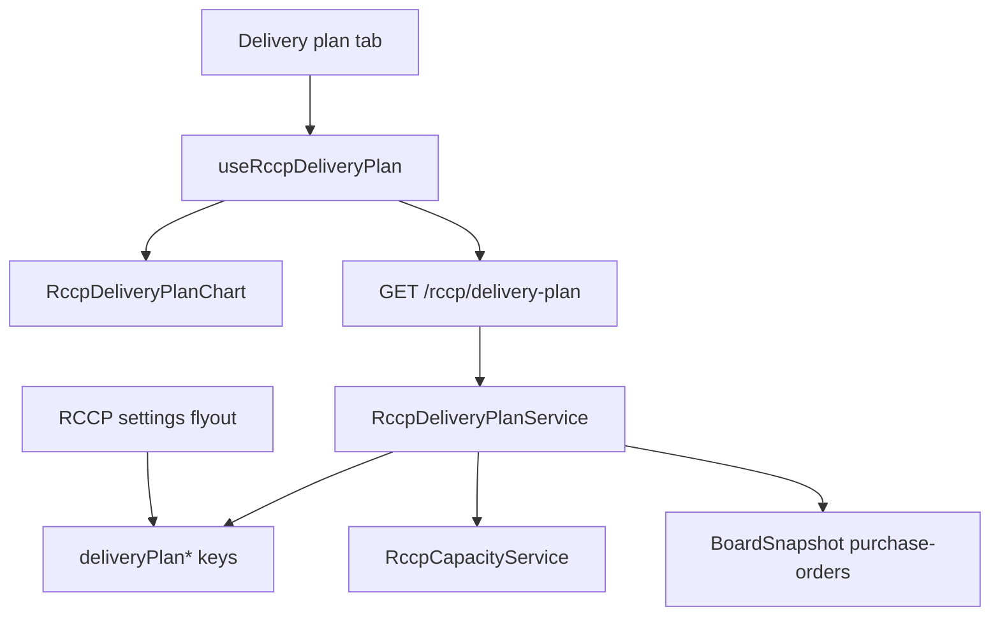

# RCCP Delivery Plan chart tab

## User story

Als planner wil ik op de RCCP-pagina een extra tab zien met een wekelijkse levergrafiek per leverancier (gepland vs ontvangen vs open vs capaciteit), waarbij ik zelf kies welke PO-kolommen de geplande datum, ontvangstdatum, bestelde hoeveelheid en geleverde hoeveelheid zijn, zodat ik de nieuwe weergave kan vergelijken met het bestaande dashboard zonder dat dashboard te wijzigen.

## Beslissingen

- **Nieuwe tab**, niet vervangen. Bestaande tabs `Dashboard` en `Capacity planning` blijven. Later kan Dashboard weg als deze tab beter is.
- **Alleen live data.** Geen testdata, geen vaste capaciteit van 500.
- **Korrel = PO-regel**, niet orderkop. Live orders hebben meerdere regels met eigen datums. `orderId` = `purchaseOrderNumber|lineNumber`. Detailregel toont beide.
- **`openQty` altijd berekend:** `Math.max(0, orderedQty - deliveredQty)`. Nooit als aparte instelling.
- **`plannedDate` wordt nooit overschreven** door een ontvangstdatum.
- **UI Engels** (`Delivery plan`, `Today`, `Ordered`, `Delivered`, `Overdue`, `Over capacity`).
- **Velden kiesbaar in RCCP-instellingen** (zelfde flyout/pagina als nu), in een eigen sectie zodat het oude dashboard zijn huidige kolommen houdt.
- **Capaciteit = som over categorieën** per vendor+ISO-week (één lijn, zoals de mockup). Dit wijkt bewust af van het per-categorie-dashboard.

## Gesloten aannames (niet meer kiezen)

- Geen SQL-migratie: vier keys in bestaande RCCP JSON (`app_settings`).
- Kolomlijst = dezelfde enriched PO-kolommen als `useRccpSettings` (`enriched=1`). Datumdropdowns: alle kolommen. Aantaldropdowns: alleen `rccpMeasure`.
- Geen `plannedDate` → regel overslaan (niet in de grafiek).
- Geen `purchaseOrderNumber` → `recordKey` als orderdeel van `orderId`.
- Geen capaciteitsrij voor een week → geen stippellijn, arcering of `+N` die week.
- Weekvelden tonen bij `dashboard` én `delivery-plan` (nu alleen `activeTab === 'dashboard'` in [RccpPageContent.jsx](src/components/rccp/RccpPageContent.jsx)).
- Vendor verplicht op `GET /rccp/delivery-plan` (400), behalve supplier-scope.
- Delay: nieuwe helper `differenceInIsoWeeks` in [server/utils/isoWeek.js](server/utils/isoWeek.js) (weekstarts, jaarwissel-veilig). Geen `date-fns`.
- Y-as: gedeelde schaal, max van planningtotaal en ontvangsttotaal in het venster.

## Veldkeuze (admin)

Nieuwe config-sectie **Delivery plan** in [RccpSettingsForm.jsx](src/components/rccp/RccpSettingsForm.jsx) / flyout. Extraheer [RccpDeliveryPlanFields.jsx](src/components/rccp/RccpDeliveryPlanFields.jsx) zodat het formulier onder 300 regels blijft.

Vier sleutels in [RccpSettingsService.js](server/services/RccpSettingsService.js) + tests in [RccpSettingsService.test.js](server/services/RccpSettingsService.test.js):

- `deliveryPlanPlannedDateKey` — datumkolom, default `requestedDeliveryDate` (zelfde fallback regel → header)
- `deliveryPlanDeliveredDateKey` — datumkolom, default `productReceiptDate` als die enriched kolom bestaat, anders leeg
- `deliveryPlanOrderedQtyKey` — getalskolom met `rccpMeasure`, default `quantity`
- `deliveryPlanDeliveredQtyKey` — getalskolom met `rccpMeasure`, default `receivedPurchaseQuantity` als die bestaat, anders leeg

Lege delivered-date of delivered-qty: regel telt als nog niet geleverd (`deliveredDate = null`, `deliveredQty = 0`).

Validatie: keys moeten naar bestaande enriched kolommen wijzen; ongeldige keys vallen stil terug naar default/leeg, net als `openMeasureKey` nu. Het oude dashboard (`dateColumnKey`, `quantityMeasures`) blijft ongewijzigd.

## Architectuur

Data laadt **alleen als de tab actief is** en een vendor gekozen is. Geen extra call op Dashboard.

## Backend

Nieuw [server/services/RccpDeliveryPlanService.js](server/services/RccpDeliveryPlanService.js) + [RccpDeliveryPlanService.test.js](server/services/RccpDeliveryPlanService.test.js).

- Hergebruik `readBoardSnapshot`, vendor-scope, `excludedStatuses`, ISO-weekhelpers uit [server/utils/isoWeek.js](server/utils/isoWeek.js).
- Map elke PO-regel naar het contract: `orderId`, `orderedQty`, `deliveredQty`, `openQty`, `plannedDate`, `deliveredDate`.
- Filter: `plannedDate` of `deliveredDate` valt in het weekvenster (anders verdwijnt een late ontvangst van een eerdere planweek).
- Capaciteit: som `availableQty` per vendor+ISO-week over alle categorieën.
- Wrap zware stappen in `time()`.
- Endpoint `GET /rccp/delivery-plan` in [server/routes/rccp.js](server/routes/rccp.js) met dezelfde window-query als analysis. Bestaande auth/scope blijft. Zonder vendor: 400 (behalve supplier).

Response (kern): `{ orders, weeks, weeklyCapacity, config }`. Geen fixture-orders.

## Frontend

Tab `delivery-plan` in [RccpPageContent.jsx](src/components/rccp/RccpPageContent.jsx). Zelfde vendorfilter. Weekvenster bij dashboard én delivery-plan. Settings-knop blijft beschikbaar.

Nieuwe map `src/components/rccp/delivery-plan/` (elk bestand onder 300 regels):

- `RccpDeliveryPlanTab.jsx` — lege staat, loading, error, detailregel
- `RccpDeliveryPlanChart.jsx` — Recharts `ComposedChart` met positieve planning en negatieve ontvangst
- `RccpDeliveryPlanShapes.jsx` — custom bar-shapes
- `RccpDeliveryPlanOverlay.jsx` — Today-band, capaciteitslijn, één verbindingslijn achter de kolommen
- `RccpDeliveryPlanLegend.jsx` + Recharts-tooltip (geen Fluent `<Tooltip>` op segmenten)
- `rccpDeliveryPlanModel.js` + `.test.js` — groeperen, weekkleur, delay, overdue, totals; zware groepering in `measure()`

Hook [src/hooks/useRccpDeliveryPlan.js](src/hooks/useRccpDeliveryPlan.js): `apiRequest`, `loading`/`error`, reload bij settings-save (`publishRccpSettingsSaved`) en PO-revisie.

## Grafiekcontract

- Recharts: per week één stacked bar (boven + onder). Segmenten via custom shape, niet één `Bar`-serie per order.
- Geleverd boven: fill-opacity 0.06, stroke-opacity 0.22.
- Open boven: opacity 1. Achterstallig open: fill-opacity 0.78, stroke `tokens.colorPaletteRedForeground1`, stroke-width 3. Geen tekst "Overdue" in de bovenste bars (status staat in detailregel/tooltip).
- Deels geleverd: licht `deliveredQty` + vol `openQty` in dezelfde planweek.
- Ontvangst onder: alleen `deliveredQty`, kleur van de planweek.
- Delay-label alleen onderaan: `+1w` / `−1w`; nooit `0w`.
- Capaciteit: rode stippellijn (`tokens.colorPaletteRedForeground1`); alleen het deel boven de lijn arceren; label `+120`.
- Today: band + lijn + "Today"; weglaten als de huidige week buiten het venster valt.
- Weekkleur: vaste lijst van 8–10 Fluent palette-foreground tokens, index = hash(`year-Wxx`) % length. Filter wijzigt de kleur niet.
- Verbindingslijn achter kolommen; max één; geen lijn als `deliveredDate` null.
- Tooltip = Recharts custom content.

**Detailregel:** `{order} · line {n} · ordered {q} · delivered {q} · open {q} · planned {dd-mm-yyyy} · delivered {dd-mm-yyyy|not yet delivered} · {n} week(s) late|early`

**Tooltip:** dezelfde velden, elk op een eigen regel (`Order`, `Line`, `Ordered`, `Delivered`, `Open`, `Planned`, `Actually delivered`, `Variance`).

**Lege staat (geen vendor):** `Search for a vendor above to load the delivery plan.`

**Geen data:** `No purchase order lines in this week range.`

## Buiten scope

- Dashboard-grafiek/matrix niet wijzigen of verwijderen
- Testdata / hardcoded 500
- Wijzigen van `plannedDate` in D365 of op het PO-board

## Acceptatiecriteria

1. Derde tab **Delivery plan** op `/rccp`; Dashboard en Capacity planning ongewijzigd.
2. Admin kiest de vier bronkolommen in RCCP-instellingen; na Save herlaadt de tab.
3. Grafiek toont live regels van de gekozen leverancier in het weekvenster.
4. Weekkleur, segmenten, transparantie, achterstallig, ontvangstkleur, capaciteit, Today, hover/selectie en totalen kloppen met het grafiekcontract hierboven.
5. UI-teksten Engels; `openQty` altijd berekend; `plannedDate` ongewijzigd.
6. Supplier ziet alleen eigen vendor, read-only settings.
7. Unit-tests voor mapping/ISO-delay/overdue/totals; `npm test` groen; versie in [src/config/version.js](src/config/version.js) verhoogd.
8. Browser-check op `/rccp`: tab openen, vendor kiezen, grafiek zien, hover toont detail, Save settings herlaadt de tab.
9. `devTestItem` in [src/config/devTestItems.js](src/config/devTestItems.js); `docs/guides/RCCP.md` bijgewerkt.

## DevOps-structuur

**Feature:** #258 RCCP Delivery Plan chart tab

**Child User Stories:**

### Story A (#259) — Delivery plan settings en API

1. RCCP-instellingen hebben een sectie Delivery plan met vier dropdowns (qty alleen `rccpMeasure`).
2. Config-keys staan in `RccpSettingsService` (JSON in bestaande app_settings, geen SQL-migratie).
3. `GET /rccp/delivery-plan` geeft `{ orders, weeks, weeklyCapacity, config }` terug; 400 zonder vendor (behalve supplier).
4. `openQty` is altijd `max(0, orderedQty - deliveredQty)`; `plannedDate` wordt nooit overschreven.
5. Lege delivered-date/qty = niet geleverd; regel zonder plannedDate wordt overgeslagen.
6. Capaciteit is som `availableQty` per vendor+ISO-week; geen rij = geen lijn die week.
7. `differenceInIsoWeeks` + unit-tests voor mapping, jaarwissel, overdue en totalen; `npm test` groen.
8. Validatie is nieuwe logica, geen bestaand precedent: [RccpSettingsService.js](server/services/RccpSettingsService.js) valideert vandaag geen enkele kolomkey tegen de enriched-kolomlijst (`openMeasureKey` checkt alleen membership binnen de ingediende `quantityMeasures`; `dateColumnKey`/`vendorColumnKey` checken alleen non-empty, geen registry-lookup). De vier delivery-plan keys moeten echt tegen de live enriched-kolomlijst valideren (`rccpMeasure`-vlag voor de qty-keys, kolom-existentie voor de datumkeys), inclusief toegang tot `TableRegistryService` vanuit de normalize-functie.

### Story B (#260) — Delivery plan tab en grafiek

1. Tab **Delivery plan** naast de bestaande tabs; die blijven ongewijzigd.
2. Weekvenster zichtbaar op Dashboard én Delivery plan; data alleen bij actieve tab + vendor.
3. Planning boven, ontvangst onder met planweekkleur; status, capaciteit, Today volgens grafiekcontract.
4. UI Engels; geen Fluent Tooltip op segmenten; weekkleur stabiel per `year-Wxx`.
5. Custom shapes (geen Bar-serie per order); Y-as gedeelde schaal.
6. [useRccpPage.js](src/hooks/useRccpPage.js) (dashboard-analyse) alleen enabled bij `activeTab === 'dashboard'`, naast de nieuwe gating van `useRccpDeliveryPlan`. Vandaag draait de dashboard-fetch door zodra er een vendor gekozen is, ongeacht de actieve tab (`enabled = hasVendor`, niet tab-afhankelijk) — met een derde tab wordt die achtergrond-waste vaker geraakt.

### Story C (#261) — Delivery plan interactie, tests en documentatie

1. Hover/klik markeert boven + onder en tekent één verbindingslijn (geen lijn zonder `deliveredDate`).
2. Detailregel en tooltip in het Engels volgens de copy hierboven; nooit `0w`.
3. `docs/guides/RCCP.md`, `devTestItem`, `measure()` rond client-groepering, versiebump.
4. Browser-checkbaar op `/rccp` (tab, vendor, grafiek, hover, settings-reload).
5. Commit-prefix `feat` + `#AB:258`.

**Tags:** `rccp; delivery-plan; chart; settings`
