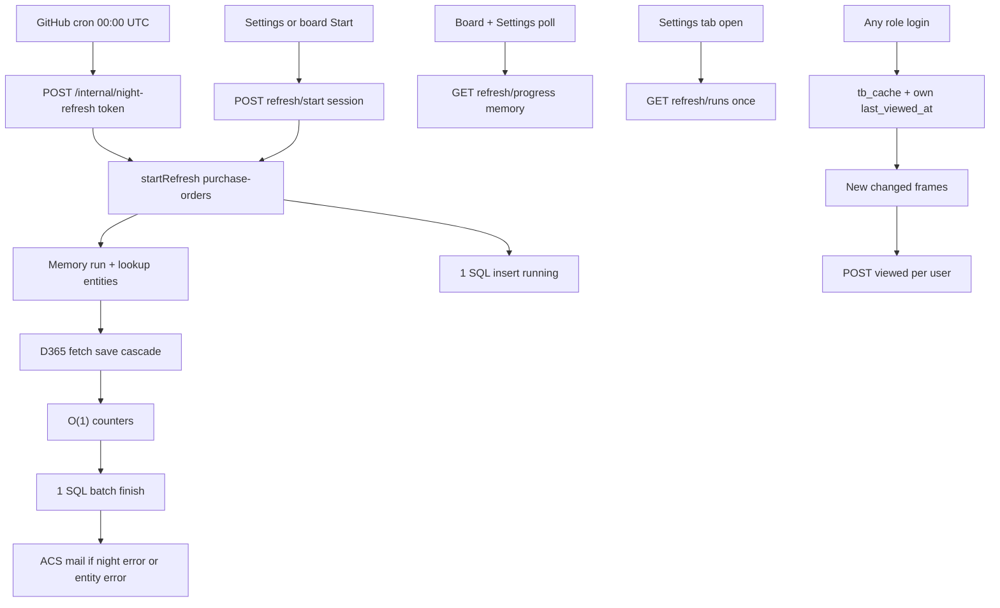

# D365 refresh — inzicht, night job en Seen

## Beslissingen (vastgelegd)

- **Eén run** start via bestaande `POST /api/data/purchase-orders/refresh/start` en cascade naar lookup-targets (nu vendors, items, product-receipt-lines). Geen losse `startRefresh`-jobs.
- Handmatige Start (Settings + board) en de **nachtwekker** starten diezelfde run. Tweede pad is alleen auth (sessie vs token), niet een tweede refresh-motor.
- Wekker: **GitHub Actions cron** 00:00 UTC, alleen productie. Geen Logic App / altijd-aan replica.
- Iedereen ziet verse cache + new/changed-kaders tot hij zelf **Mark as seen** klikt. Geen admin-goedkeuring.
- Settings-tab toont live voortgang (geheugen) en historie (SQL). Counts = cache-rijen inserted/updated/removed-from-cache, niet ledger-events.
- Cascade-volgorde: **bestaande PO-eerst**, daarna lookup-targets. Niet omdraaien.
- Tab + board-voortgang: **admin-only**. Employee ziet de sidebar D365 refresh niet en ziet geen voortgang op de PO-board-refreshknop.
- Ledger-kaders: per-user Seen, venster **max 14 dagen**.
- Board-progress: bestaande `progress` blijft (Data model); extra `run`. Settings: `?view=full`. Geen tweede live-endpoint.
- Night-HTTP: fail-closed token, alleen production, rate-limit POST, Bearer-header. Al running → `attached`.
- **Seen-rechten (review ronde 3):** `POST /api/data/purchase-orders/viewed` mag voor **admin, employee en supplier**. Andere tableKeys blijven `requireRole(ADMIN)`. `refresh/start` blijft admin-only. Supplier heeft een extra allowlist-regel in [`dataAccess.js`](server/middleware/dataAccess.js); employee gaat al door `dataAccess` en mag Seen na het versoepelen van de route-guard.
- **Cascade-status + mail (review ronde 3):**
  - `run.status = error` alleen als **purchase-orders zelf** faalt.
  - Lookup-falen: `entity.status = error`, `run.status = done`, `run.error_text` = korte samenvatting (`vendors: …`).
  - Night-mail **wel** bij: `run.error`, `run.interrupted`, of minstens één `entity.error`.
  - Night-mail **niet** bij: volledig `done` zonder entity-errors, of attached op een geslaagde manual run zonder entity-errors.
  - Handmatige Start-fout: geen mail. ACS-fout of skip wijzigt de run-status niet.

## Resultaat: data voor iedereen, kaders tot Seen

Lezen uit `tb_cache`. Iedereen (admin, medewerker, vendor) ziet verse rijen. Vendor-scoping blijft.

Nu is “gezien” een **admin-baseline** (`MAX(last_viewed_at)` van admins, `POST .../viewed` admin-only, `canMarkViewed={isAdmin}`).

Nieuw:

- Baseline = `tb_user_view_state` van **deze** user.
- Iedereen met bordtoegang mag Mark as seen. Inloggen telt niet.
- UI: `canMarkViewed = true` voor elke rol met bordtoegang; knoptitel `Mark changes as seen` (niet “Only admin can mark as seen”).
- Drie dagen niet Seen = drie nachten kaders bij elkaar. Geen daglabel.
- Als `last_viewed_at` bestaat, wint die van `last_full_sync_at` (read, details, ledger-window, revision `userViewedAt`). Night/manual sync wist geen ongeziene dagen.
- **14-dagenvenster:** `baseline = last_viewed_at ?? last_full_sync_at`; `sinceMs = baseline == null ? null : max(baseline, now - 14d)`. Er is geen aparte ledger-retentie-setting; 14 dagen is de enige harde grens. Eerste Seen-klik zet `last_viewed_at`; inloggen doet dat niet.

## Harde eisen (review ronde 1–3 — bouwen, geen nazorg)

- `sinceMs = max(baseline, now - 14d)` met `baseline = last_viewed_at ?? last_full_sync_at`.
- `NIGHT_REFRESH_TOKEN` ontbreekt of korter dan **32 tekens** → 503, geen refresh. Alleen `APP_ENV=production`. Timing-safe compare. Geen stacks/secrets in status of mail.
- Header: `Authorization: Bearer <token>` (niet in querystring of logs).
- Workflow: `PROD_APP_URL` + Bearer-header, geen Azure-login, poll 20–30s, `concurrency: night-refresh-prod` (`cancel-in-progress: false`).
- Al running → 202 `{ attached: true, runId }`. Mail volgens de cascade-regel hierboven.
- Mail asynchroon. ACS-fout of skip → run-status ongewijzigd; kolom `alert_status` (`sent` / `skipped` / `failed` / null) zodat Settings “alert not sent” in de historie kan tonen.
- Process-start: SQL-rijen `running` → `interrupted`; night daarvan mailt wél.
- Seen-route: zie Beslissingen. Tests in [`dataAccess.test.js`](server/middleware/dataAccess.test.js): supplier POST viewed 200-pad; supplier POST refresh/start blijft 403; andere tableKeys viewed blijven 403 voor supplier.
- `getLastViewedAt(tableId, userId)` krijgt een `userId`-parameter; SQL wisselt van
  `WHERE u.role = 'admin'` naar `WHERE vs.user_id = @userId`. Drie call sites volgen mee:
  `read()` in [TableDataService.js](server/services/TableDataService.js) (userId al in scope
  op de aanroepregel), `readRowDetails()` (nieuwe param + caller in
  [data.js](server/routes/data.js) geeft `req.user.id` door), en de inline
  `adminViewedAt`-subquery in `getRevisionByTable()` (hernoemen naar `userViewedAt`).
  Geen nieuwe tabel: `tb_user_view_state` en `markViewed()` blijven ongewijzigd.
- `GET refresh/progress` en `GET /admin/d365-refresh/runs` zijn `requireRole(ADMIN)` —
  employee/vendor krijgen 403, ook bij een directe API-call. Geen tweede live-API.
- Progress-payload (bestaande clients houden):
  - default: `{ running, progress, run: { currentLabel, overall, entityIndex, entityCount } }`
  - `progress` blijft `fetched` / `saved` / `status` / `lookupWarnings` (Data model + oude hook)
  - board-UI leest `run.*`; poll **alleen** als `isAdmin && running` (geen 403-toast)
  - `?view=full`: plus `entities[]` + gestript `error_text`
- Historie `limit` clamp 20. `error_text` = korte veilige zin, `NVARCHAR(500)`, geen stacks.
- Alert-emails: `GET`/`PUT /api/admin/d365-refresh/alert-emails` via bestaande [`SettingsService`](server/services/SettingsService.js), key `NIGHT_REFRESH_ALERT_EMAILS`. E-mailadressen valideren.
- Internal-routes mounten in [`server/server.js`](server/server.js) **zonder** `requireSession`; token-middleware. POST extra limiter **5/min**; GET status mag pollen (niet dezelfde strenge limit).
- GH-statuscontract:
  - `{ running, status, finishedAt, error_text }` — geen stack, geen token
  - fail als `status` in `{error, interrupted}` of timeout ~45 min
  - success als `status=done` (ook attached)
  - na POST: `running=false` en geen `finishedAt` → fail (crash/down)
- Unit tests op service/token-helper; HTTP night-start niet in localhost-E2E. Lokaal dezelfde run via Settings-Start.
- `time('refresh_run_sql')` rond start-insert en finish-batch. Board blijft `apiRequest`.

## Snelheid (blijft gelden + ledger-cap)

- Live = geheugen. SQL alleen 1 insert bij start + 1 batch bij einde.
- Settings pollt niet elke 2s de history-SQL. Historie één keer bij tab-open + één keer na `done`/`error`.
- Geen extra `apiRequest` op het board. Live in het bestaande progress-endpoint.
- Counts: inserted/updated via `MERGE … OUTPUT $action` in `persistRecordsChunk` (geen extra COUNT per rij); deleted via OUTPUT van de `removed_at_source`-update in `refresh()`.
- Optimistic UI: queued entity-slots = `purchase-orders` + lookup-targets uit `getLookups()` (nu 4).
- Board/Settings-poll alleen terwijl `running` én admin, interval 1250 ms. GH-poll 20–30s.
- Ledger-read voor kaders: max 14 dagen terug.

## Architectuur

Migratie `scripts/db/migrations/041_tb_refresh_runs.sql` (041 is vrij), **idempotent** (`IF NOT EXISTS`):

- `tb_refresh_runs`: `id`, `started_at`, `finished_at`, `status` (`running` / `done` / `error` / `interrupted`), `source` (`manual` / `night`), `triggered_by_user_id` (null bij night), `error_text NVARCHAR(500)`, `alert_status` (`sent` / `skipped` / `failed` / null), gedenormaliseerde totalen
- `tb_refresh_run_entities`: per tabel fetched/saved, inserted/updated/deleted (cache-rijen), status, tijden, `error_text NVARCHAR(500)`
- Index `started_at DESC`

Live in Maps; bij process-start `running` → `interrupted`. Geen aparte last-run-tabel: night-last-run = laatste rij in `tb_refresh_runs` gefilterd op `source=night`; historie toont alle runs.

Night-logica woont in `RefreshRunService` (nieuw) + een kleine internal-route — geen uitbreiding
van `TableDataService.js` (al 5000+ regels) buiten de bestaande hooks (`getLastViewedAt`-wijziging
en de OUTPUT-counters).

**Rij-counts (vast):** inserted = nieuwe cache-rij; updated = bestaande rij met veldverschil; deleted = `removed_at_source = 1` deze run. UI: `Removed from cache`, niet `Deleted in D365`. Geen backfill. `Fetched from D365` vs `Cache rows` gescheiden.

**API**

Live (geen SQL): één snapshot-helper; default houdt `progress` in stand, Settings `?view=full`. Beide achter `requireRole(ADMIN)`.

Historie: `GET /api/admin/d365-refresh/runs` — limit default/max 20, `requireRole(ADMIN)`, `error_text` gestript.

Night (geen sessie), gemount in `server.js` zonder `requireSession`:

- `POST /api/internal/night-refresh` — Bearer-token, fail-closed, alleen `APP_ENV=production`, POST 5/min. Start dezelfde run met `source=night`. Al running → `attached: true`.
- `GET /api/internal/night-refresh/status` — token, statuscontract hierboven.

Settings-schrijven (admin): `GET`/`PUT /api/admin/d365-refresh/alert-emails` → `dbo.app_settings` (`NIGHT_REFRESH_ALERT_EMAILS`).

## Frontend

Eén sidebar **D365 refresh** in [AdminPage.jsx](src/components/admin/AdminPage.jsx), admin-only
sidebar-item (niet gerenderd voor employee/vendor). Splits onder 300 regels.

- [useD365Refresh.js](src/hooks/useD365Refresh.js) — start + progress-poll; historie eenmaal. Mag de bestaande [usePurchaseOrderRefreshProgress.js](src/hooks/usePurchaseOrderRefreshProgress.js) uitbreiden i.p.v. een tweede poller. Nederlandse timeout-string in die hook omzetten naar Engels als het bestand wijzigt.
- `AdminD365Refresh.jsx` — header, (i) GitHub/Seen via `AdminInfoHint`, Start, alert-emails + save (`Field` + `maxWidth`)
- `D365RefreshLivePanel.jsx` — overall + entity ProgressBars (aantal = PO + lookups)
- `D365RefreshHistory.jsx` — 20 runs; night-badge; **geen** `<Tooltip>` in de lijst (`title=` of `AdminInfoHint`)
- Board: [PurchaseOrderRefreshProgress.jsx](src/components/supplier/PurchaseOrderRefreshProgress.jsx) — huidige stap + `run.overall`; geen insert-counts op het board. Admin-only voortgang; employee/vendor zien de knop zonder voortgangstekst/spinner (`canRefresh` blijft Start blokkeren).
- Mark as seen voor elke rol in [PurchaseOrdersPageTopBar.jsx](src/components/supplier/PurchaseOrdersPageTopBar.jsx)

(i)-tekst (Engels), ongeveer — moet expliciet uitleggen dat het 14-dagenvenster geen data
verwijdert maar alleen de new/changed-kaders laat vervallen:

> Night refresh runs once a day in production via GitHub Actions, not an Azure Logic App or always-on container. That keeps Azure cost near zero. It starts the same D365 run as the Start button. Staff and vendors see new and changed frames until they click Mark as seen — each person for themselves. If someone doesn't click Mark as seen, frames older than 14 days fade away automatically; no data is deleted, only the "new/changed" highlight stops applying to older changes. The schedule is 00:00 UTC.

## GitHub workflow

[`.github/workflows/night-refresh-prod.yml`](.github/workflows/night-refresh-prod.yml): cron `0 0 * * *`, `workflow_dispatch`, **geen** `environment: production`, `concurrency: night-refresh-prod` (niet cancellen). `curl` naar `PROD_APP_URL` (repo-secret) + `Authorization: Bearer`; geen Azure-login, geen token in URL of logs. Poll elke 20–30s tot done of ~45 min volgens het statuscontract. Als de app down is: geen ACS-mail; falende GH-job is het signaal.

De GitHub-environment `production` heeft `required_reviewers` (deploy-gate). Night-refresh mag die environment niet gebruiken, anders hangt cron op approval. `PROD_APP_URL` en `NIGHT_REFRESH_TOKEN` zijn **repository-secrets**. Security-gate blijft server-side.

In [deploy-prod.yml](.github/workflows/deploy-prod.yml), zelfde patroon als `session-secret` (secret set + `--set-env-vars`):

- `NIGHT_REFRESH_TOKEN`
- `ACS_CONNECTION_STRING`
- `ACS_FROM_EMAIL`

(`preview.yml` zet ACS al; zonder deze regels is night-mail in prod een gok.) Token niet loggen (`curl -s`, geen `-v` met header).

## Kosten (bewust niet)

- Geen Logic Apps, Functions, Container Apps Jobs, `minReplicas=1` voor deze feature
- Geen nightrefresh op DEV/preview
- Geen extra mailproduct
- Geen SQL-poll of extra board-calls tijdens een run

## Kwaliteitspoort

- UI: tokens, Field/maxWidth, Engels, AdminInfoHint. **Escaleer `ui-design-review`.**
- Snelheid: geen extra board-`apiRequest`; geen SQL-COUNT in persist-loop; `time('refresh_run_sql')`
- Security: token fail-closed + prod-only + POST 5/min; e-mail valideren; geen secrets in mail; parameterized SQL; security-review op de interne route
- Tests: snapshot-helper (board vs full), RefreshRunService, seen-baseline + 14d-cap, dataAccess viewed-allowlist + employee viewed, e-mailvalidatie, token fail-closed, attached-run, mail faalt niet de run, admin-only 403 op refresh/progress + /admin/d365-refresh/runs, cascade-status (PO ok + lookup fail → done + entity.error + night-mail)
- Versie PATCH in [src/config/version.js](src/config/version.js)
- `devTestItems.js` vullen bij push naar DEV

## Lokaal testen

- Settings → D365 refresh: Start toont meteen queued entity-rijen (PO + lookups); balk beweegt zonder history-wait
- Network: tijdens run alleen progress-poll; `/runs` 1× open + 1× na done
- Employee: D365 refresh-tab niet zichtbaar; directe call naar `refresh/progress` of `/admin/d365-refresh/runs` geeft 403
- Employee Mark as seen op het board: geen 403; wist alleen eigen kaders
- Boardknop als admin: cascade wisselt van tekst; balk loopt door. Als employee: knop zichtbaar zonder voortgangstekst/spinner, Start blijft disabled; geen progress-poll
- Mark as seen als vendor (niet 403) wist alleen eigen kaders; tweede user houdt de zijne
- Drie nachten zonder Seen: kaders blijven; na Seen weg; >14 dagen valt weg ook zonder klik
- Network board-poll: geen `entities[]` / `error_text` in de default progress-JSON; `progress.lookupWarnings` blijft bestaan
- Night-HTTP weigert buiten production; service-tests dekken token/attached/mail-regels
- ACS-fout na successevolle night-run: status blijft done; `alert_status=failed` of skipped
- Geen commit/push tenzij je dat vraagt
