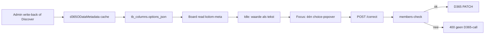

# D365 write-back keuzelijst (enums)

**DevOps:** [Feature #273](https://dev.azure.com/reyniervanbommel0745/Vendor-App/_workitems/edit/273) — children #274 (metadata), #275 (validatie), #276 (UI)

**Spec:** [docs/specs/2026-08-24-d365-writeback-enum-choices-design.md](../../docs/specs/2026-08-24-d365-writeback-enum-choices-design.md)

**Goal:** Als een D365-kolom write-back én een OData-enum is, toont de cel de metadata-members als keuze; ongeldige waarden worden in de app geweigerd, zonder extra board-calls.

**Architecture:** `$metadata` alleen op admin-pad (write-back aan / Discover), in-memory cache 24u. Members in bestaande `tb_columns.options_json` als `{ kind: 'd365Enum', enumType, members }`. Board-kolommeta levert ze al mee. Idle-cel = tekst; één Fluent Popover (patroon [WeekNumberCalendarPopover.jsx](../../src/components/supplier/WeekNumberCalendarPopover.jsx)) alleen voor de actieve cel.

**Niet in v1:** FK-lookups, sync-filter `ENUM_FIELDS` vervangen, write-back op geblokkeerde keys (`status`, `orderNumber`, `createdDateTime`, `lineNumber`).

## Bestanden

- Nieuw: `server/utils/d365ODataMetadata.js` + `.test.js` — fetch `$metadata`, parse EnumType/Member, TTL-cache, `time('d365_metadata')`
- Nieuw: `server/utils/d365WriteBackEnumOptions.js` + `.test.js` — veld → `{ kind, enumType, members }` of null; fallback [d365EnumFields.js](../../server/utils/d365EnumFields.js)
- Nieuw: `src/utils/writeBackChoiceMembers.js` + `.test.js` — members uit `column.options`
- Nieuw: `src/components/supplier/PurchaseOrderWriteBackChoicePopover.jsx` — alleen gemount als cel actief
- Wijzig: [TableColumnsService.js](../../server/services/TableColumnsService.js) `setWriteBackConfig` — bij `writable=1` options vullen; bij `0` enum-options wissen
- Wijzig: [TableDataService.js](../../server/services/TableDataService.js) — discover ververst options van writable bronkolommen; `correctField` weigert waarde buiten `members` (400), PATCH-body ongewijzigd
- Wijzig: [PurchaseOrderWriteBackCell.jsx](../../src/components/supplier/PurchaseOrderWriteBackCell.jsx) (~261 regels: **eerst splitsen**) — enum → idle tekst + popover; anders bestaande Input
- Wijzig: [version.js](../../src/config/version.js) PATCH +1

`data_type` van bronkolommen niet naar `select` zetten. Custom select blijft een string-array; helper kijkt naar `kind === 'd365Enum'`.

## Taken

1. **Spec + tests parser** — specbestand schrijven. Failing tests: XML-fixture → members per property; cache-hit zonder tweede fetch; onbekend veld → leeg.
2. **Metadata-module** — `getEntityEnumMap` via bestaande `getBaseUrl` / `buildHeaders` / timeout uit [D365ODataService.js](../../server/services/D365ODataService.js). Parser niet in dat grote servicebestand.
3. **Options op de kolom** — `resolveEnumOptions` + schrijven in `setWriteBackConfig` en `discoverSourceFields`. Metadata-fout: warning, toggle slaagt, `options` null (vrij veld).
4. **Validatie `correctField`** — exacte member-match; leeg = 400; geen members = huidig vrij-tekstpad. Test 400 zonder D365-mock.
5. **UI-split** — choice-popover (Engels: “Select value”); huidige waarde die niet in de lijst staat als extra regel. Geen Dropdown per gridcel. Header- en regelcellen via bestaande WriteBackCell.
6. **Versie + poort** — `version.js`; Fluent-tokens; geen extra `apiRequest` op board-read; geen nieuwe route.

## Aantoonbaar

- Write-back aan op een enum (niet `status`) → keuzelijst → kiezen schrijft terug
- Write-back op tekst/getal/datum → ongewijzigd
- Ongeldige POST `/correct` → 400, geen D365
- `$metadata` down bij toggle → write-back aan, vrije tekst
- Network bij board-open: geen `$metadata`, geen extra options-endpoint
