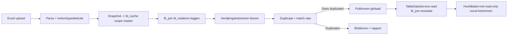

# Plan: Excel-koppeling naar hoofdtabel (via de tb_*-laag)

## Laagkeuze (vastgelegd)
Een geüploade Excel is **gewoon nog een bron** en de koppeling is **exact fk_join-lookupverrijking** — hetzelfde mechanisme dat het Vendors/Items-plan al bouwt. Daarom bouwen we op het bestaande metamodel ([011_tb_metamodel.sql](scripts/db/migrations/011_tb_metamodel.sql), [TableDataService.js](server/services/TableDataService.js), route [data.js](server/routes/data.js)) en **niet** op een nieuw, parallel `tb_external_*`-systeem.

Een Excel-upload wordt:
- een rij in **`tb_sources`** met een nieuwe `provider_type = 'excel'`,
- een platte **`tb_tables`**-rij (scope master, geen detail),
- **`tb_columns`** met `source='source'` (gedetecteerde kolommen),
- rijdata in **`tb_cache`** (`data_json`, scope master) — het "JSON vs getypeerd"-vraagstuk is hier al opgelost,
- gekoppeld via een **`tb_relations`**-rij met `relation_kind='fk_join'` + `join_keys_json`.

Zo erven de verrijkingskolommen gratis alle bestaande machinerie (zichtbaarheid, volgorde/breedte, filter, sort, kolom-pickers) en bouwen we één ding dat aansluit op de al-gekozen richting (memory: *"Vendors/Items via tb_* generiek"*, *"D365 PO: generiek platform gekozen"*).

## Harde afhankelijkheid
Dit plan hergebruikt de **fk_join-leesresolutie** die als Fase 3 in [dev_2026-07-03-datamodel-vendors-items-tb.plan.md](.cursor/plans/dev_2026-07-03-datamodel-vendors-items-tb.plan.md) staat (`TableDataService.read()` resolvet fk_join-relaties tegen `tb_cache` van de doeltabel, master én detail). Is dat nog niet gemerged, dan draagt dit plan die stap mee (`dependency-fk-join-read`). We bouwen géén tweede join-engine.

## Conceptcorrectie t.o.v. het oude plan
- **Geen 1-op-1 maar many-to-one.** Veel hoofdrijen kunnen naar één Excel-rij wijzen (bv. veel PO-regels → één item). Uniekheid is alleen vereist aan de **datasetzijde** (de join-key in de Excel), niet aan de hoofdtabelzijde.
- **Master én detail scope.** De koppeling moet ook op detail-niveau kunnen (item-lookup per PO-regel), niet alleen master.
- **Nederlandse UI** (conform CLAUDE.md "Dutch UI labels throughout") — badges/stappen in het Nederlands, niet Engels.

## Relevante bestaande bouwblokken
- Generieke tabel-API: [server/routes/data.js](server/routes/data.js)
- Leeslaag (fk_join komt hier): [server/services/TableDataService.js](server/services/TableDataService.js)
- Lees-helpers (relatie + join_keys al gemapt): [server/services/TableRegistryService.js](server/services/TableRegistryService.js#L61)
- Metamodel: [scripts/db/migrations/011_tb_metamodel.sql](scripts/db/migrations/011_tb_metamodel.sql)
- Admin-entrypoint: [src/components/admin/datamodel/AdminDataModel.jsx](src/components/admin/datamodel/AdminDataModel.jsx)
- Diagram (n:1 fk_join-lijn bestaat al in vendors/items-plan): [src/components/admin/datamodel/DataModelDiagram.jsx](src/components/admin/datamodel/DataModelDiagram.jsx)
- Veldkeuze-dialog voor consistente kolomkeuze: [src/components/admin/datamodel/FilterFieldPickerDialog.jsx](src/components/admin/datamodel/FilterFieldPickerDialog.jsx)
- `xlsx@0.18.5` zit al in dependencies (parser aanwezig).

## Oplossingsontwerp

### Fase 1 — Excel als bron in het metamodel (migratie)
Volgende vrije migratie (**016** als 015 uit het vendors/items-plan al bestaat), idempotent + non-destructief:
- `CK_tb_sources_provider` uitbreiden met `'excel'` (constraint droppen + hermaken).
- **Geen** nieuwe `tb_external_*`-tabellen: hergebruik `tb_tables`, `tb_columns`, `tb_cache`, `tb_relations`.
- Optioneel `tb_upload_batches` (louter upload-metadata: `source_id`/`table_id`, bestandsnaam, rij-telling, `uploaded_by`, `status`, `uploaded_at`) voor audit/herupload-historie — niet voor rijdata.
- `refresh()` moet voor een `excel`-tabel een no-op zijn (cache-is-leidend; er is geen externe bron om te pollen). Zet `cache_mode='always'`/aparte guard zodat de lazy-refresh de snapshot niet wegvaagt.

### Fase 2 — Upload, parse en snapshot (backend)
Nieuwe `ExcelUploadService` + multipart-endpoint (er is nog geen multer/formidable — die transportlaag toevoegen):
- Ontvang bestand → `xlsx` parse → **kolomdetectie + type-inschatting** (text/number/date/boolean).
- **Dataset-sleutel-check**: admin kiest de Excel-sleutelkolom; normaliseer (trim, lege rijen negeren, case-optie) en **blokkeer publicatie bij duplicaten aan datasetzijde** met een rapport (aantal + voorbeelden).
- Schrijf de snapshot weg als: `tb_tables`-rij (indien nieuw) + `tb_columns(source='source')` + `tb_cache`-rijen (scope master, `data_json`, `partition_key` per partitie-keuze — zie Fase 5).
- **Her-upload** van dezelfde dataset: vervang de `tb_cache`-snapshot voor dat `table_id`, **behoud** de fk_join-link en de kolomkeuze; log een nieuwe `tb_upload_batches`-rij. Nieuwe/verdwenen kolommen: rapporteer, deactiveer weeskolommen niet-destructief.

### Fase 3 — Koppeling als fk_join + admin-kolomkeuze (backend)
Admin-only endpoints (logisch los van één tableKey — een dataset wordt *aan* een hoofdtabel gekoppeld):
- Leg/wijzig een `tb_relations`-rij `relation_kind='fk_join'` van hoofdtabel → excel-tabel met `join_keys_json` (hoofdsleutelveld ↔ dataset-sleutelveld) en **scope (master|detail)**.
- Kies welke excel-kolommen **read-only verrijkingskolommen** worden (globaal zichtbaar; erven `tb_columns`-zichtbaarheid).
- Activeren/deactiveren + lijst ophalen. **Geen aparte join-engine**: `read()` resolvet de fk_join al.

### Fase 4 — Koppel-wizard (AdminDataModel)
Nieuwe sectie "Externe databronnen" met 4 stappen, subcomponents <300 regels:
1. **Upload** — bestand kiezen, kolommen + samples tonen.
2. **Sleutels koppelen** — hoofdtabel-sleutelveld + dataset-sleutelveld, scope master/detail.
3. **Kolommen kiezen** — checkbox-lijst met type/samples.
4. **Valideren & publiceren** — duplicate-check, **match-rate preview**, activeren.

Diagram-preview via [DataModelDiagram.jsx](src/components/admin/datamodel/DataModelDiagram.jsx): hoofdtabel-kaart ── n:1 fk_join-lijn ── Excel-kaart met join-velden als badge. Statusbadges (NL): `Klaar`, `Dubbele sleutels`, `Lage match`, `Gepubliceerd`. Herbruik het veldkeuze-patroon uit [FilterFieldPickerDialog.jsx](src/components/admin/datamodel/FilterFieldPickerDialog.jsx).

### Fase 5 — Validatie, beveiliging, robuustheid
- Alleen **admin** mag uploaden/koppelen/publiceren (`requireRole('admin')`).
- Bestandstype + **grootte-limiet** + **rij-cap** (schaal-grens; `read()` bouwt al alle rijen in geheugen — géén ongelimiteerde dataset joinen op de hot path).
- **xlsx-hardening**: SheetJS 0.18.5 heeft historische prototype-pollution/ReDoS-advisories → pin/valideer; verdedig tegen zip-bombs en formule-injectie; strip formules, lees waarden.
- **Partition-gedrag expliciet**: `tb_cache` is gepartitioneerd op `dataAreaId`. Een Excel heeft geen partitie → kies bewust: (a) join alleen op `record_key` binnen één company, of (b) partition-loze dataset met een vaste sentinel-partitie. Cross-company-lek voorkomen.
- Ontbrekende match → leeg veld, **geen rij-drop** (left-join-gedrag; identiek aan vendor/item-miss).
- Foutmeldingen in duidelijke **Nederlandse** UI-teksten.

### Afronding
- Backend-tests: parse/typedetectie, duplicate-detectie, snapshot→`tb_cache`, fk_join-hit/miss/cross-company, **her-upload behoudt link/kolommen**.
- Route-tests: autorisatie + foutpaden (ongeldig bestand, ongeldige sleutels, duplicaten).
- Frontend-test: wizard-state (stapnavigatie, validatiefouten, publish-disabled).
- Versie ophogen in [src/config/version.js](src/config/version.js); regressiecheck op PO-flow en generieke `/api/data/:tableKey`.

## Visuele stroom (high level)

## Risico's / aandachtspunten
- **Afhankelijkheid fk_join-read** (vendors/items Fase 3): niet dubbel bouwen; wel eerst afmaken.
- **Migratievolgorde**: nummer na het vendors/items-migratienummer kiezen.
- **`refresh()`-interactie**: excel-tabel mag nooit door een bron-refresh worden leeggemaakt — expliciete guard.
- **Schaal**: rij-cap + index op join-keys in `tb_cache` (`IX_tb_cache_record` bestaat al) i.v.m. lopend performance-verbeterplan.
